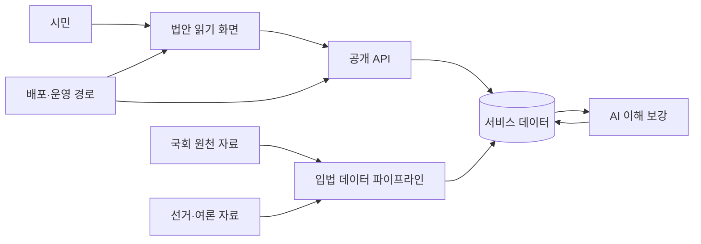
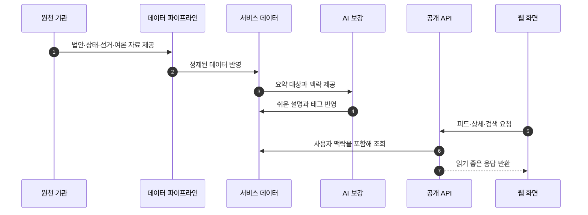

## Abstract

Lawdigest는 국회 법안과 정치 데이터를 시민이 읽기 쉬운 형태로 바꾸는 서비스다. 웹 화면, 공개 API, 데이터 파이프라인, AI 요약, 선거·여론 자료 처리, 배포 운영이 하나의 흐름으로 이어진다.

## Introduction

이 저장소는 단일 화면 앱보다 넓다. 사용자는 법안을 피드와 상세 화면으로 읽고, 서버는 법안·의원·정당·사용자 활동을 제공하며, 별도 파이프라인은 국회와 선거 원천 자료를 모아 서비스 데이터로 만든다. AI 계층은 법안 원문을 쉬운 요약과 심화 리포트로 바꾼다.

## Related Work

- [법안 읽기 경험](./bill-reading/README.md)
- [공개 API와 도메인 모델](./public-api/README.md)
- [입법 데이터 파이프라인](./data-pipeline/README.md)
- [AI 입법 지능](./ai-intelligence/README.md)
- [선거·여론 인사이트](./election-insight/README.md)
- [배포와 운영](./deployment-operations/README.md)

## Description

Lawdigest의 핵심 루프는 원천 자료를 수집하고, 서비스 데이터로 정리하고, 사람이 읽을 수 있는 화면으로 내보내는 과정이다.



기능은 크게 세 층으로 나뉜다. 첫째, 시민이 직접 만나는 법안 읽기 화면이 있다. 둘째, 그 화면이 기대는 도메인 API와 인증·개인화 모델이 있다. 셋째, 원천 자료를 계속 새로 고치고 AI 설명을 채우는 데이터·AI 운영 흐름이 있다.

```text
사용자 경험
  법안 피드 · 상세 · 탐색 · 검색 · 마이페이지

서비스 API
  법안 · 의원 · 정당 · 인증 · 팔로우 · 알림 · 통계

데이터 운영
  법안 수집 · 처리 단계 동기화 · 선거 자료 · 여론조사 파싱 · AI 리포트
```

이 문서 트리는 저장소 구조를 그대로 베끼지 않는다. 사용자가 이해하는 기능 단위를 기준으로 묶고, 각 paper의 앞부분에 실제 구현 위치를 metadata로 남긴다.

## Conclusion

Lawdigest를 읽을 때는 웹 화면에서 시작해도 되고, 데이터 파이프라인에서 시작해도 된다. 두 길은 모두 같은 서비스 데이터로 모이며, AI 계층은 그 데이터를 시민의 언어로 풀어내는 역할을 맡는다.
