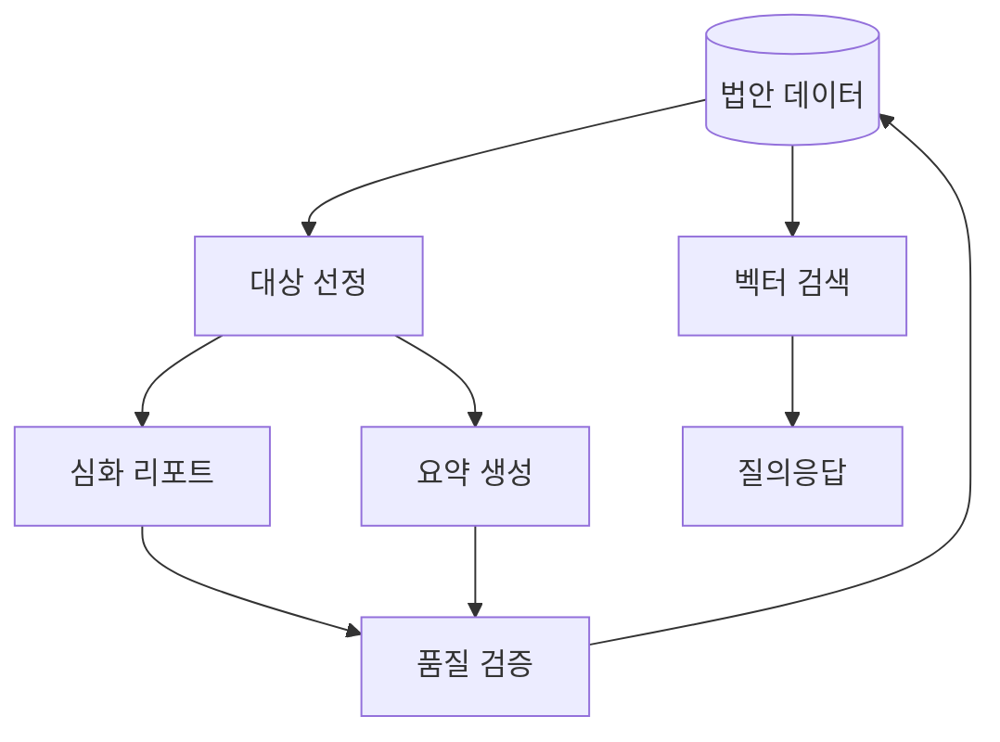
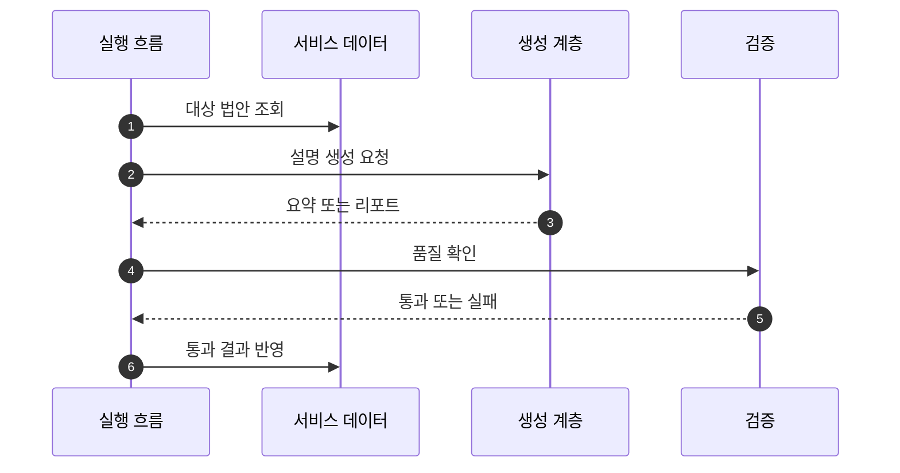

## Abstract

AI 입법 지능은 법안 원문과 관련 자료를 쉬운 설명, 태그, 심화 리포트, 질의응답으로 바꾸는 기능이다. 생성 결과는 검증을 거쳐 서비스 데이터나 산출물로 남는다.

## Introduction

Lawdigest의 AI 계층은 단순한 문장 요약만 하지 않는다. 법안별 기본 요약, 통과 법안 중심의 심화 리포트, 법률 용어 풀이, 벡터 기반 질의응답까지 포함한다. 운영 흐름은 생성 결과가 사용자에게 보이기 전에 구조와 문체를 확인하도록 설계되어 있다.

## Related Work

- [Lawdigest](../README.md)
- [에이전트 법안 리포트](./agentic-bill-report/README.md)
- [법안 RAG 질의응답](./rag-chat/README.md)
- [입법 데이터 파이프라인](../data-pipeline/README.md)
- [법안 읽기 경험](../bill-reading/README.md)

## Description

AI 계층은 서비스 데이터에서 대상 법안을 읽고, 모델 또는 에이전트 실행을 거쳐 설명을 만든다. 결과는 곧바로 신뢰하지 않고 형식, 금지 표현, 필수 섹션, 태그 구조를 검증한다.



AI 기능은 두 방향으로 나뉜다. 하나는 법안별 설명을 만들어 데이터에 반영하는 생성 흐름이고, 다른 하나는 저장된 법안 내용을 검색해 질문에 답하는 검색 흐름이다.

```text
AI 기능
├─ 기본 법안 요약
├─ 심화 법안 리포트
├─ 법률 용어 보강
├─ 태그와 분야 분류
└─ 벡터 검색 기반 질의응답
```

운영에서 중요한 점은 실패를 정상 결과처럼 보이지 않게 하는 것이다. 검증 실패나 모델 장애는 산출물과 실행 결과에 남아야 하며, 사용자가 보는 데이터는 통과한 결과만 반영해야 한다.

## Conclusion

AI 입법 지능은 Lawdigest가 법안을 시민의 언어로 바꾸는 핵심 계층이다. 생성 자체보다 중요한 것은 근거 확인, 검증, 저장 계약을 지키는 일이다.
