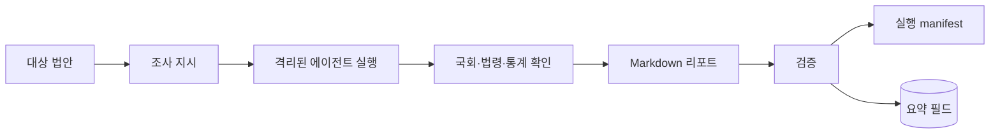
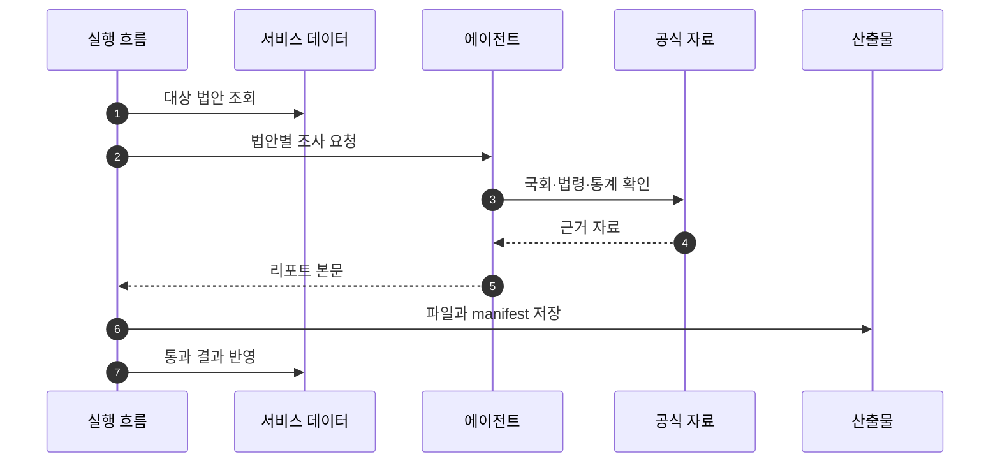

## Abstract

에이전트 법안 리포트는 법안 하나를 더 깊게 읽어 쉬운 요약과 주요 내용을 만드는 기능이다. 외부 공식 자료를 확인하고, 정해진 형식 검증을 통과한 결과만 저장한다.

## Introduction

짧은 요약만으로는 복합 개정안의 의미가 잘리지 않을 때가 있다. 이 기능은 법안의 처리 결과, 위원회 경과, 관련 법령, 필요한 통계를 확인한 뒤 사용자가 읽을 수 있는 리포트를 만든다.

## Related Work

- [AI 입법 지능](../README.md)
- [법안 상세 읽기](../../bill-reading/bill-detail/README.md)
- [입법 데이터 파이프라인](../../data-pipeline/README.md)

## Description

리포트 생성은 대상 선정에서 시작한다. 통과 법안 중심 또는 전체 법안 대상으로 실행할 수 있고, 읽기와 쓰기 모드를 분리해 운영 데이터를 읽으면서 저장은 막는 검토 흐름도 가능하다.



검증은 형식과 문체를 모두 본다. 필수 섹션이 있는지, 내부 조사 표현이 남지 않았는지, 어려운 용어를 필요할 때 설명했는지, 화면에 바로 보여도 되는 문체인지 확인한다.

```text
검증 관문
├─ 필수 섹션 존재
├─ 내부 도구명과 조사 메모 제거
├─ 어려운 용어 풀이
├─ 사용자 화면용 문체
└─ 실행 manifest 기록
```

이 기능은 생성 실패를 숨기지 않는다. 실패한 법안은 성공한 결과와 분리되어 manifest에 남고, 중단 옵션을 켜면 첫 실패에서 실행을 멈출 수 있다.

## Conclusion

에이전트 법안 리포트는 AI 설명 품질을 높이는 정밀 경로다. 핵심은 많은 말을 생성하는 것이 아니라, 공식 자료 확인과 검증을 통과한 설명만 사용자 데이터로 보내는 것이다.
