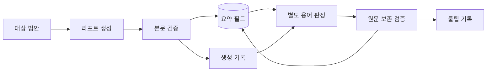
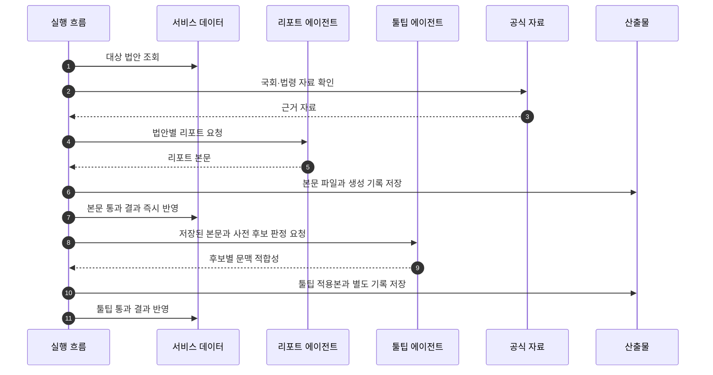

## Abstract

에이전트 법안 리포트는 법안 하나를 더 깊게 읽어 쉬운 요약과 주요 내용을 만드는 기능이다. 본문 생성과 법률용어 툴팁 보강은 독립적으로 실행되며, 각 단계에서 검증을 통과한 결과만 저장한다.

## Introduction

짧은 요약만으로는 복합 개정안의 의미가 잘리지 않을 때가 있다. 이 기능은 법안의 처리 결과, 위원회 경과, 관련 법령, 필요한 통계를 확인한 뒤 사용자가 읽을 수 있는 리포트를 만든다.

## Related Work

- [AI 입법 지능](../README.md)
- [법안 상세 읽기](../../bill-reading/bill-detail/README.md)
- [입법 데이터 파이프라인](../../data-pipeline/README.md)

## Description

리포트 생성은 대상 선정에서 시작한다. 통과 법안 중심 또는 전체 법안 대상으로 실행할 수 있고, 읽기와 쓰기 모드를 분리해 운영 데이터를 읽으면서 저장은 막는 검토 흐름도 가능하다. 본문이 저장된 뒤에는 생성 기록이나 저장 데이터를 입력으로 별도 용어 판정 과정을 실행할 수 있다.



본문 검증은 형식과 문체를 본다. 필수 섹션이 있는지, 내부 조사 표현이 남지 않았는지, 화면에 바로 보여도 되는 문체인지 확인한다. 툴팁 검증은 후보 정의의 문맥 적합성과 표면어 일치를 확인하고, 적용 후 툴팁을 제거했을 때 원문이 그대로인지 확인한다.

```text
검증 관문
├─ 필수 섹션 존재
├─ 내부 도구명과 조사 메모 제거
├─ 사용자 화면용 문체
├─ 툴팁 문맥·표면어 판정
├─ 툴팁 제거 후 원문 일치
└─ 단계별 실행 기록
```

이 기능은 실패를 숨기지 않는다. 본문 생성과 툴팁 보강은 각자의 실행 기록에 성공·건너뜀·실패를 남긴다. 툴팁 실패는 이미 저장된 리포트의 성공을 취소하거나 기존 본문을 덮어쓰지 않는다.

## Conclusion

에이전트 법안 리포트는 AI 설명 품질을 높이는 정밀 경로다. 핵심은 많은 말을 생성하는 것이 아니라, 공식 자료 확인과 검증을 통과한 설명만 사용자 데이터로 보내는 것이다.
