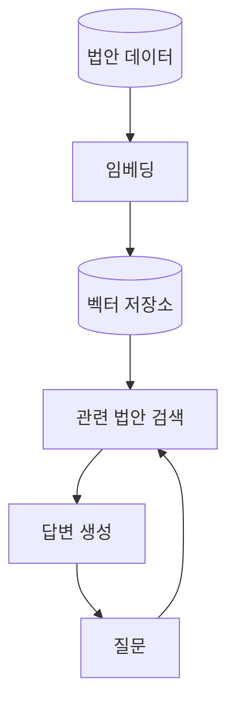
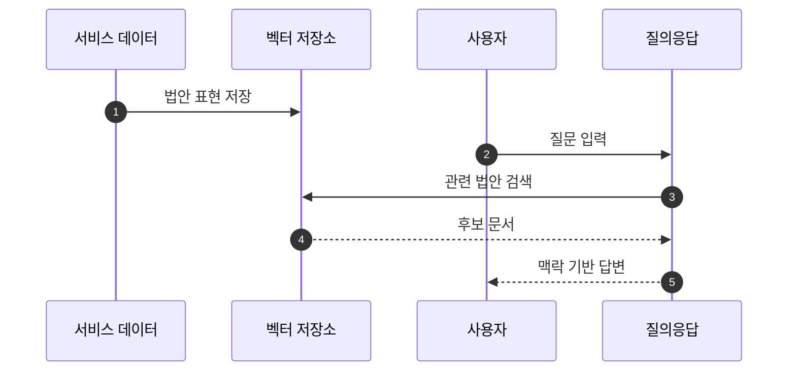

## Abstract

법안 RAG 질의응답은 저장된 법안 내용을 벡터 검색으로 찾고, 질문에 맞는 답변을 만드는 기능이다. 요약 데이터와 검색 인프라를 연결해 사용자가 자연어로 법안을 탐색하게 한다.

## Introduction

사용자는 법안명을 정확히 모를 수 있다. 주제나 생활 속 질문으로 접근할 때는 검색어 매칭만으로 부족하다. 이 기능은 법안의 요약과 본문 정보를 검색 가능한 표현으로 바꾸고, 관련 문서를 바탕으로 답변한다.

## Related Work

- [AI 입법 지능](../README.md)
- [법안 읽기 경험](../../bill-reading/README.md)
- [공개 API와 도메인 모델](../../public-api/README.md)

## Description

질의응답은 준비 단계와 질문 단계로 나뉜다. 준비 단계에서는 법안 데이터를 임베딩해 벡터 저장소에 넣는다. 질문 단계에서는 사용자의 질문과 가까운 법안을 찾고, 그 내용을 답변 맥락으로 사용한다.



이 기능은 법안 피드와 다른 탐색 방식을 제공한다. 피드는 목록을 따라 읽게 하고, 질의응답은 질문에서 관련 법안으로 들어가게 한다.

```text
질문형 탐색
질문
  -> 관련 법안 후보
  -> 요약과 상세 맥락
  -> 답변
  -> 필요하면 상세 화면으로 이동
```

검색 품질은 원천 법안 데이터와 요약 품질에 크게 좌우된다. 따라서 RAG는 AI 요약과 별개의 기능이지만, 실제 사용 품질은 같은 데이터 체계 안에서 함께 결정된다.

## Conclusion

법안 RAG 질의응답은 사용자가 검색어를 몰라도 법안에 접근하게 하는 보조 입구다. 법안 카드와 상세 화면을 대체하기보다, 그곳으로 가는 자연어 길을 만든다.
