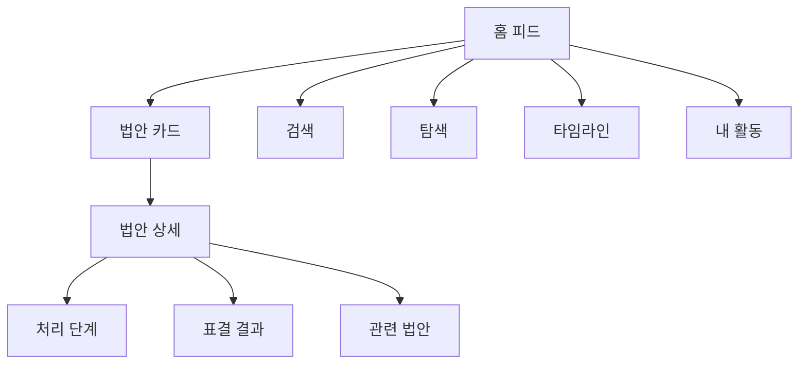
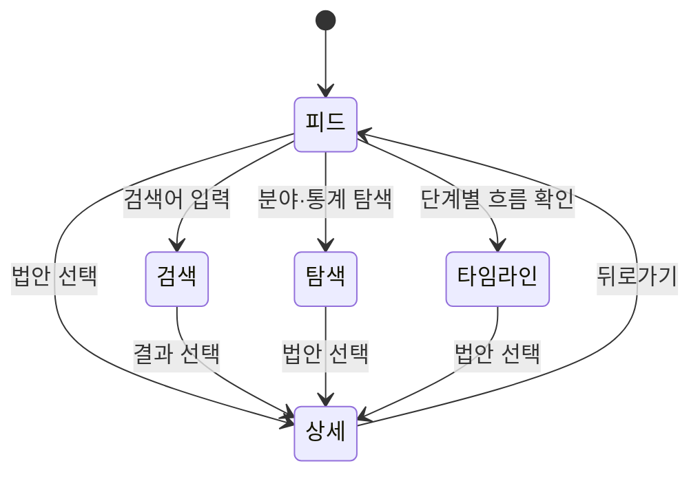

## Abstract

법안 읽기 경험은 시민이 법안을 발견하고, 요약을 훑고, 상세 맥락까지 따라갈 수 있게 하는 웹 기능이다. 피드, 상세, 검색, 탐색, 타임라인, 개인 활동 화면이 같은 법안 표현을 공유한다.

## Introduction

법률개정안은 길고 어렵다. 이 기능은 법안의 제목, 쉬운 요약, 진행 상태, 발의자, 표결, 유사 법안을 한 화면 흐름 안에 배치해 사용자가 빠르게 이해하도록 돕는다. 사용자가 로그인한 경우에는 저장과 팔로우 상태도 같은 화면에 녹아든다.

## Related Work

- [Lawdigest](../README.md)
- [법안 상세 읽기](./bill-detail/README.md)
- [개인화와 알림](./personalization/README.md)
- [공개 API와 도메인 모델](../public-api/README.md)
- [AI 입법 지능](../ai-intelligence/README.md)

## Description

웹 화면은 법안 목록을 먼저 보여주고, 각 법안 카드는 상세 화면으로 이어진다. 목록은 단계와 정렬 조건을 바꿔 읽을 수 있고, 상세 화면은 같은 법안 표현 위에 처리 단계와 표결 같은 깊은 정보를 덧붙인다.



공통 법안 카드는 요약을 안전하게 표시하고, 중복 목록을 줄이며, 정부안과 위원장안처럼 발의자 표현이 다른 법안을 구분한다. 같은 표현을 홈 피드, 의원·정당 상세, 검색 결과, 마이페이지에서 다시 쓴다.

```text
공통 법안 표현
├─ 제목과 발의 정보
├─ 쉬운 요약과 태그
├─ 현재 단계와 처리 결과
├─ 저장 상태
└─ 상세로 이동하는 맥락
```

탐색 화면은 분야, 정당, 의원, 통계 패널을 통해 법안 목록 밖의 진입로를 만든다. 타임라인 화면은 제출, 위원회 심사, 본회의, 공포 같은 단계별 흐름을 보여준다.

## Conclusion

법안 읽기 경험의 중심은 같은 법안 정보를 여러 진입로에서 일관되게 읽게 하는 것이다. 더 깊게 보려면 상세 읽기와 개인화 문서를 함께 보는 것이 좋다.
