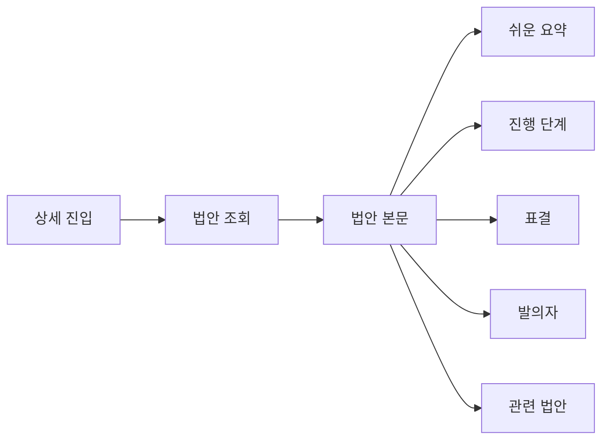
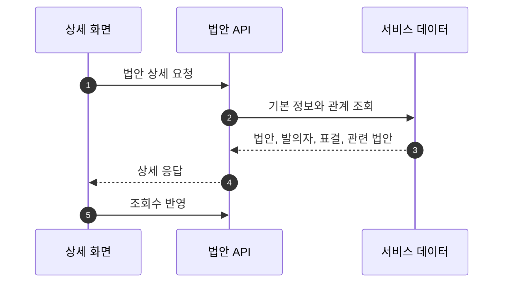

## Abstract

법안 상세 읽기는 하나의 법안을 피드보다 깊게 설명하는 기능이다. 요약, 원문 맥락, 처리 단계, 표결, 발의자, 관련 법안을 한 화면에서 이어 읽게 한다.

## Introduction

피드는 빠른 발견에 맞춰져 있지만, 사용자가 실제로 판단하려면 법안이 어디까지 진행됐고 누가 발의했으며 표결은 어땠는지 알아야 한다. 상세 화면은 목록 카드의 요약을 유지하면서 더 많은 맥락을 붙인다.

## Related Work

- [법안 읽기 경험](../README.md)
- [공개 API와 도메인 모델](../../public-api/README.md)
- [AI 입법 지능](../../ai-intelligence/README.md)

## Description

상세 화면은 서버에서 법안의 큰 덩어리를 먼저 가져온 뒤, 조회수와 저장 상태처럼 사용자 행동에 따라 바뀌는 값을 함께 반영한다.



상세 화면은 여러 조각을 세로로 쌓는다. 상단은 법안 자체의 설명이고, 그 아래는 처리 단계와 표결처럼 법안의 현재 위치를 보여준다. 관련 법안은 사용자가 같은 쟁점을 더 탐색하도록 돕는다.

```text
상세 화면
├─ 법안 카드
├─ 진행 단계
├─ 처리 결과와 표결
├─ 발의자 목록
└─ 관련 법안
```

법안 요약은 화면에서 바로 렌더링되므로 안전한 표시가 중요하다. 요약 본문은 허용된 서식만 살리고 위험한 표현은 걸러내는 경로를 지나 화면에 표시된다.

## Conclusion

법안 상세 읽기는 Lawdigest의 핵심 신뢰 지점이다. 피드에서 관심을 만든 뒤, 상세 화면에서 처리 단계와 표결까지 확인하게 하는 구조다.
