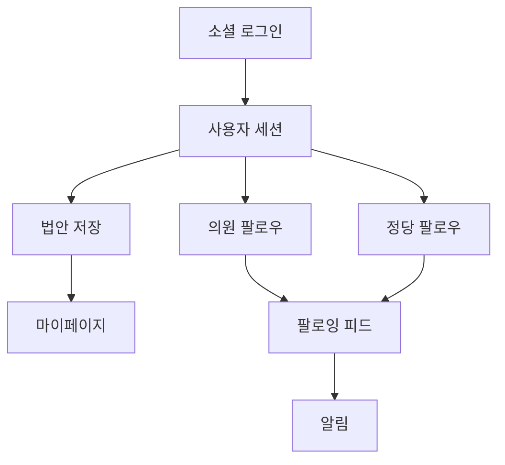
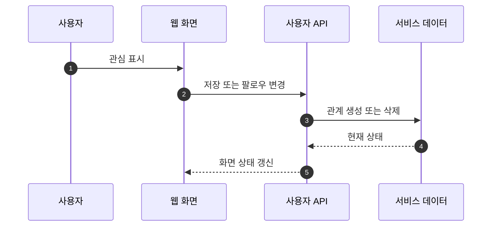

## Abstract

개인화와 알림은 사용자가 관심 법안, 의원, 정당을 계속 따라가게 하는 기능이다. 로그인, 저장, 팔로우, 마이페이지, 알림이 서로 연결된다.

## Introduction

법안은 한 번 읽고 끝나는 정보가 아니다. 처리 단계가 바뀌고, 관심 의원이나 정당의 활동도 계속 이어진다. 개인화 기능은 사용자가 관심 대상을 표시하고 다시 찾아오도록 돕는다.

## Related Work

- [법안 읽기 경험](../README.md)
- [공개 API와 도메인 모델](../../public-api/README.md)

## Description

사용자는 외부 계정으로 로그인한 뒤 법안 저장과 팔로우를 사용할 수 있다. 저장된 법안은 마이페이지에서 모이고, 팔로우한 의원과 정당은 별도 피드와 프로필 화면에서 다시 나타난다.



알림은 사용자의 관심 대상과 법안 상태 변화를 연결한다. 새 알림, 읽음 처리, 삭제, 전체 개수 조회가 같은 사용자 맥락 안에서 동작한다.

```text
개인화 데이터
├─ 저장한 법안
├─ 팔로우한 의원
├─ 팔로우한 정당
├─ 읽지 않은 알림
└─ 사용자 프로필과 탈퇴 흐름
```

팔로우와 저장은 화면에서 즉시 상태가 바뀌어 보여야 한다. 서버 응답은 최종 상태를 다시 확인해 화면의 임시 상태와 맞춘다.

## Conclusion

개인화는 법안 읽기를 일회성 검색에서 지속적인 관찰로 바꾼다. 이 기능은 인증, 사용자 관계 데이터, 알림이 함께 맞아야 자연스럽게 보인다.
