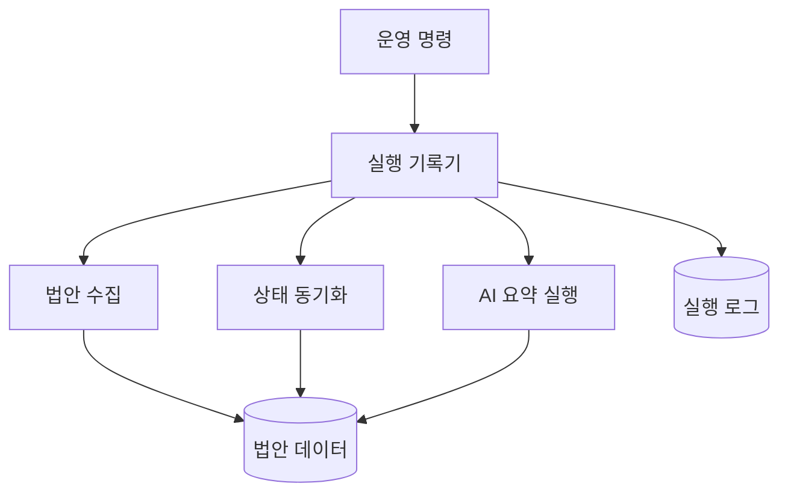
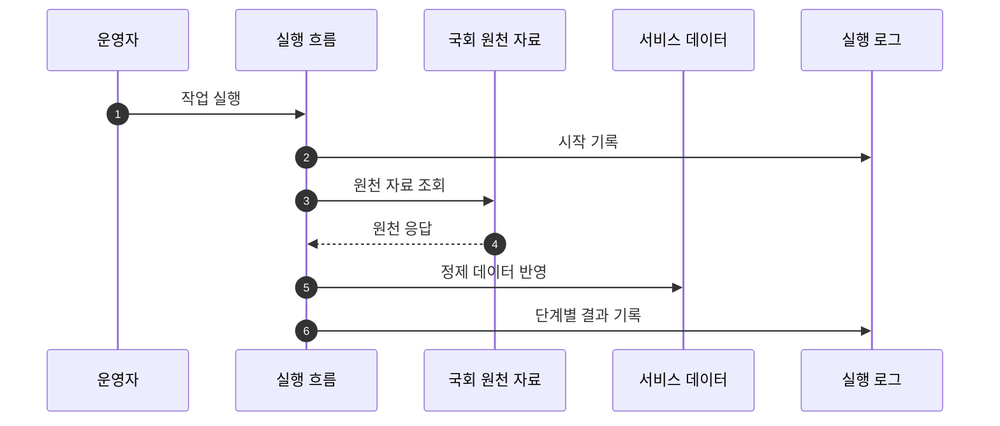

## Abstract

입법 데이터 파이프라인은 국회 원천 자료를 가져와 서비스 데이터로 정리하고, 상태 변화와 AI 요약까지 운영 흐름으로 묶는다. 현재 기준은 자체 실행 흐름이며, 오래된 자동화 파일은 참고 자료로 남아 있다.

## Introduction

법안 서비스는 원천 자료가 계속 바뀌므로 정기적인 수집과 동기화가 필요하다. 이 기능은 법안 기본 정보, 처리 단계, 표결, 요약 산출물을 같은 실행 기록 안에서 관리한다.

## Related Work

- [Lawdigest](../README.md)
- [법안 수집과 적재](./bill-ingest/README.md)
- [처리 단계와 표결 동기화](./status-sync/README.md)
- [AI 입법 지능](../ai-intelligence/README.md)
- [배포와 운영](../deployment-operations/README.md)

## Description

파이프라인은 실행 단위를 기록하고, 각 단계의 산출물과 실패 정보를 남긴다. 법안 수집은 원천 API에서 데이터를 가져와 정제한 뒤 저장소에 반영한다. 상태 동기화는 법안의 처리 이력과 표결을 별도 흐름으로 갱신한다. AI 요약은 데이터 저장소를 읽고 결과를 다시 반영한다.



운영 판단은 화면이나 오래된 자동화 기록이 아니라 현재 실행 로그와 산출물을 기준으로 한다.

```text
표준 실행 범위
├─ 법안 신규 수집
├─ 법안 처리 단계 갱신
├─ 의원과 표결 정보 갱신
├─ AI 요약·리포트 생성
└─ 실행 로그와 산출물 확인
```

이 파이프라인은 서비스 API와 느슨하게 결합된다. API는 이미 정리된 데이터를 읽고, 파이프라인은 백그라운드에서 그 데이터를 최신 상태로 유지한다.

## Conclusion

입법 데이터 파이프라인은 Lawdigest의 데이터 신뢰도를 지탱한다. 새 운영 기능을 볼 때는 이 흐름이 실제 기준인지, 아니면 과거 자동화의 흔적인지 먼저 구분해야 한다.
