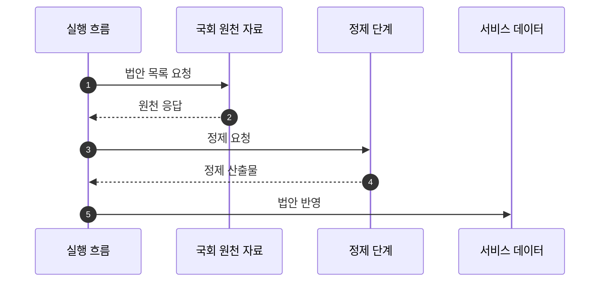

## Abstract

법안 수집과 적재는 국회 원천 자료를 서비스가 읽을 수 있는 법안 데이터로 바꾸는 기능이다. 수집, 정제, 저장을 나누어 각 단계의 결과를 확인할 수 있게 한다.

## Introduction

원천 자료는 서비스 화면에 바로 쓰기 어렵다. 필드 이름과 값의 의미를 맞추고, 발의자와 처리 정보가 서비스 모델에 맞도록 정리해야 한다. 이 기능은 그 과정을 단계별 산출물로 남긴다.

## Related Work

- [입법 데이터 파이프라인](../README.md)
- [처리 단계와 표결 동기화](../status-sync/README.md)
- [공개 API와 도메인 모델](../../public-api/README.md)

## Description

수집 단계는 원천 기관에서 법안 목록을 가져온다. 정제 단계는 서비스 모델에 맞게 필드를 바꾸고 빠진 값을 보정한다. 저장 단계는 기존 법안과 새 법안을 구분해 데이터베이스에 반영한다.



단계를 나누는 이유는 운영 중 실패를 좁히기 위해서다. 수집이 실패했는지, 정제가 실패했는지, 저장이 실패했는지 나누어 확인할 수 있다.

```text
적재 책임
├─ 원천 자료 가져오기
├─ 서비스 필드로 변환
├─ 발의자와 법안 관계 정리
├─ 기존 데이터와 병합
└─ 결과와 오류를 산출물로 남김
```

법안 적재는 이후 상태 동기화와 AI 요약의 입력이 된다. 여기서 데이터가 흔들리면 상세 화면과 리포트도 함께 흔들린다.

## Conclusion

법안 수집과 적재는 가장 앞단의 데이터 품질 관리 기능이다. 문제를 조사할 때는 원천 응답, 정제 산출물, 저장 결과를 순서대로 확인하는 것이 자연스럽다.
