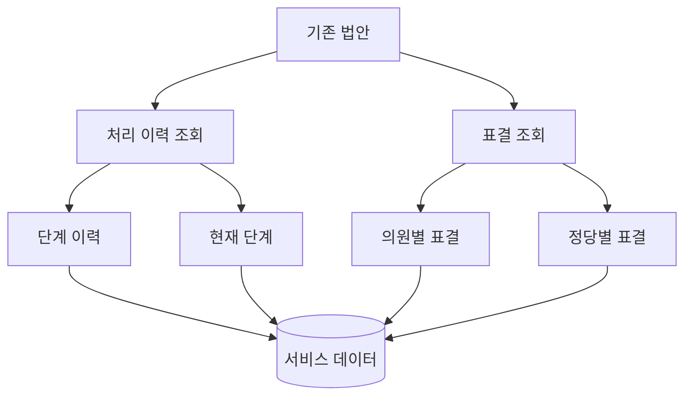
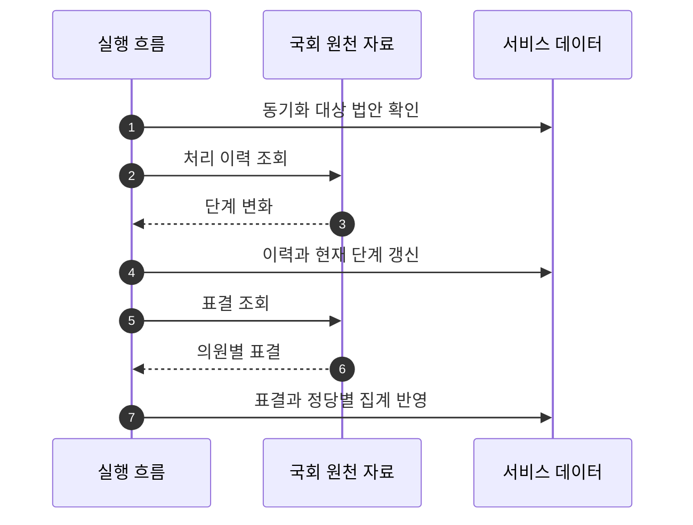

## Abstract

처리 단계와 표결 동기화는 이미 적재된 법안의 이후 움직임을 따라잡는 기능이다. 위원회, 본회의, 공포 같은 단계와 의원·정당별 표결을 서비스 데이터에 반영한다.

## Introduction

법안은 발의된 뒤에도 계속 상태가 바뀐다. 단순히 최초 수집만 해서는 상세 화면의 진행률, 타임라인, 표결 결과를 믿을 수 없다. 이 기능은 법안의 시간 흐름을 따로 갱신한다.

## Related Work

- [입법 데이터 파이프라인](../README.md)
- [법안 수집과 적재](../bill-ingest/README.md)
- [법안 상세 읽기](../../bill-reading/bill-detail/README.md)

## Description

동기화는 두 흐름으로 나뉜다. 하나는 법안의 생애주기를 가져와 단계 이력과 현재 상태를 갱신하는 흐름이고, 다른 하나는 표결 원천을 가져와 의원별·정당별 결과로 나누는 흐름이다.



단계 이력은 사용자가 법안의 경과를 읽는 데 쓰인다. 현재 단계는 목록과 상세 화면에서 빠른 상태 표시로 쓰인다. 표결은 법안 상세의 처리 결과를 설명하고, 정당별 입장 차이를 보여준다.

```text
동기화 산출물
├─ 처리 단계 이력
├─ 법안 현재 상태
├─ 의원별 표결
└─ 정당별 표결 요약
```

이 기능은 오래된 상태를 최신으로 만드는 일에 가깝다. 그래서 실행 후에는 원천 조회 수, 갱신된 항목 수, 실패한 항목을 함께 봐야 한다.

## Conclusion

처리 단계와 표결 동기화는 법안 상세의 신뢰도를 높인다. 법안이 지금 어디에 있는지와 누가 어떻게 표결했는지를 계속 갱신하는 흐름이다.
