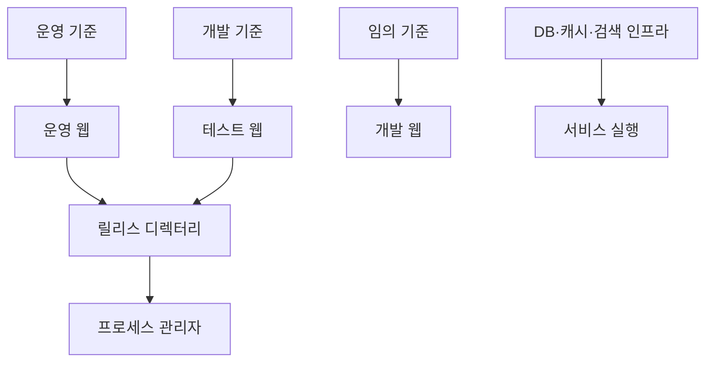

## Abstract

배포와 운영은 웹, API, 데이터 파이프라인, 인프라를 실제 서비스로 유지하는 기능이다. 웹 배포는 도메인별 기준 브랜치와 전용 스크립트가 분리되어 있다.

## Introduction

Lawdigest는 로컬 개발과 실제 서비스 운영 경로가 다르다. 운영 웹, 테스트 웹, 개발 웹은 각각 다른 기준과 실행 방식을 가진다. 데이터 파이프라인도 실행 로그와 산출물을 보고 운영 상태를 판단한다.

## Related Work

- [Lawdigest](../README.md)
- [입법 데이터 파이프라인](../data-pipeline/README.md)
- [법안 읽기 경험](../bill-reading/README.md)
- [공개 API와 도메인 모델](../public-api/README.md)

## Description

웹 배포는 도메인별로 기준이 다르다. 운영 도메인은 운영 기준 브랜치만 올리고, 테스트 도메인은 테스트 기준 브랜치를 올린다. 개발 도메인은 선택한 기준을 개발 모드로 띄운다.


테스트와 운영 웹은 특정 작업트리를 직접 서비스하지 않는다. 배포 시점의 결과를 고정된 릴리스 위치로 옮긴 뒤 현재 심링크를 바꾸는 방식이다. 그래서 작업트리를 지워도 현재 릴리스는 유지되지만, 활성 릴리스 자체를 지우면 서비스가 깨질 수 있다.

```text
운영 확인 순서
├─ 기준 브랜치 확인
├─ 전용 배포 스크립트 실행
├─ 프로세스 상태 확인
├─ 도메인 응답 확인
└─ 필요하면 현재 릴리스 확인
```

데이터 운영은 별도 런북을 따른다. 실행 성공 여부는 오래된 자동화 화면보다 현재 실행 로그, 산출물, 데이터 반영 결과를 기준으로 판단한다.

## Conclusion

배포와 운영은 기능 구현의 마지막 관문이다. Lawdigest에서는 도메인별 배포 기준과 데이터 파이프라인 운영 기준을 먼저 확인한 뒤 실행해야 한다.
