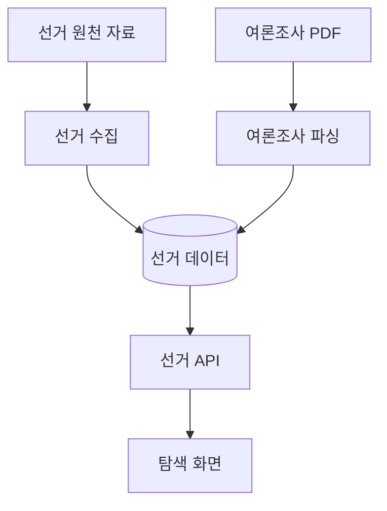
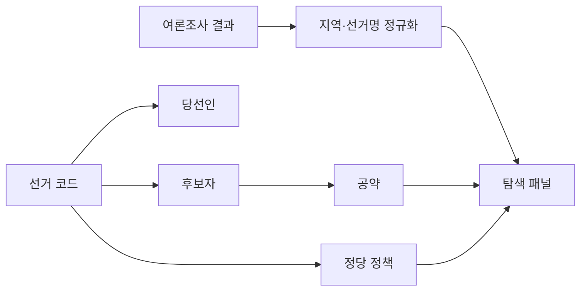

## Abstract

선거·여론 인사이트는 선거 후보자, 당선인, 공약, 여론조사 자료를 수집하고 화면에서 탐색하게 하는 기능이다. 입법 데이터와 함께 정치 정보를 넓히는 축이다.

## Introduction

Lawdigest는 법안만 다루지 않고 선거와 여론 자료도 확장하고 있다. 선거 원천 API에서 구조화 자료를 모으고, 조사기관별 PDF를 파싱해 지역·선거 단위로 볼 수 있는 데이터로 만든다.

## Related Work

- [Lawdigest](../README.md)
- [여론조사 PDF 파서](./poll-parser/README.md)
- [입법 데이터 파이프라인](../data-pipeline/README.md)
- [공개 API와 도메인 모델](../public-api/README.md)

## Description

선거 데이터는 코드, 후보자, 당선인, 공약, 정당 정책처럼 서로 의존하는 자료를 순서대로 모은다. 여론조사 데이터는 기관별 PDF 형식이 달라 별도 파서가 필요하다.



웹 탐색 화면은 법안 통계와 선거 자료를 함께 보여주는 방향으로 확장되어 있다. 지역 선택, 후보자 목록, 지도, 여론조사 개요 같은 화면 조각이 이 데이터를 소비한다.

```text
선거·여론 자료
├─ 선거 코드와 지역
├─ 후보자와 당선인
├─ 공약과 정당 정책
├─ 여론조사 설문
└─ 지역별 탐색 응답
```

이 기능은 아직 입법 파이프라인보다 더 많은 형식 다양성을 다룬다. 특히 PDF 파서는 조사기관마다 표 구조가 달라, 실제 문서 재파싱과 회귀 검증이 중요하다.

## Conclusion

선거·여론 인사이트는 Lawdigest의 시민 정보 범위를 법안 밖으로 넓힌다. 법안 데이터처럼 신뢰 가능한 원천과 파싱 검증을 계속 쌓아야 하는 영역이다.
