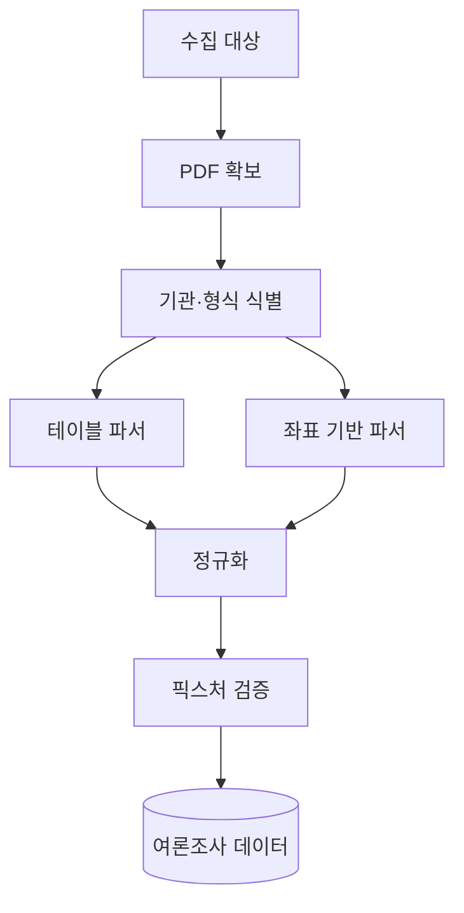
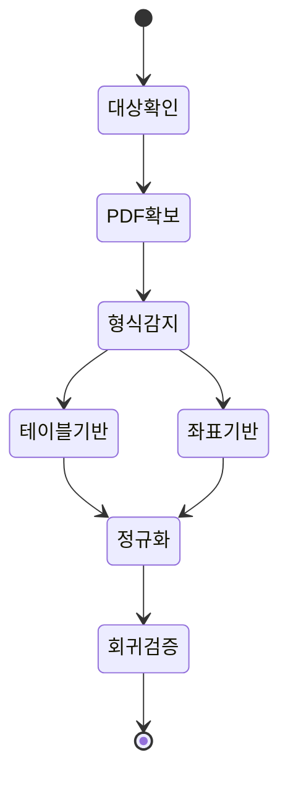

## Abstract

여론조사 PDF 파서는 조사기관마다 다른 통계표 PDF를 구조화 데이터로 바꾸는 기능이다. 테이블 기반 파서와 좌표 기반 파서를 함께 쓰고, 실제 PDF 재파싱과 픽스처 검증으로 품질을 확인한다.

## Introduction

여론조사 자료는 PDF 안의 표로 제공되는 경우가 많다. 기관마다 열 병합, 전체 행 표시, 선택지 위치, 비율 표기가 달라 하나의 단순 파서로 처리하기 어렵다. 이 기능은 기관별 형식을 감지하고 공통 모델로 정리한다.

## Related Work

- [선거·여론 인사이트](../README.md)
- [입법 데이터 파이프라인](../../data-pipeline/README.md)

## Description

파서는 먼저 대상 PDF를 모으고, 기관과 표 형식을 식별한다. 대부분은 테이블 구조를 기반으로 처리하지만, 표 감지가 되지 않는 문서는 글자 좌표를 이용해 열을 재구성한다.



공통 인프라는 병합 셀을 풀고, 전체 행을 찾고, 선택지와 비율을 나누고, 소계 열을 제거한다. 기관별 파서는 이 공통 기능을 조합해 각 PDF의 특이한 모양을 처리한다.

```text
파싱 단계
├─ 조사기관과 문서 형식 구분
├─ 표 또는 좌표에서 전체 행 찾기
├─ 선택지와 비율 추출
├─ 지역·선거·질문 정규화
└─ 픽스처와 결과 대조
```

이 기능의 품질 기준은 실제 PDF를 다시 읽어도 같은 구조화 결과가 나오는지다. 문서에 완료라고 적혀 있어도 현재 코드와 테스트로 다시 확인해야 한다.

## Conclusion

여론조사 PDF 파서는 선거 인사이트의 데이터 품질을 좌우한다. 기관별 특수 처리를 늘리더라도, 공통 검증과 회귀 픽스처가 함께 있어야 안전하게 확장할 수 있다.
