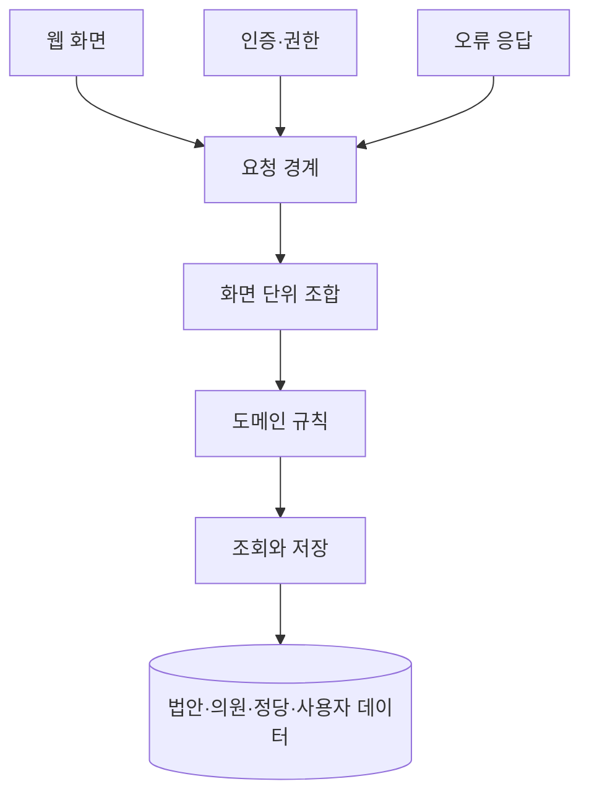
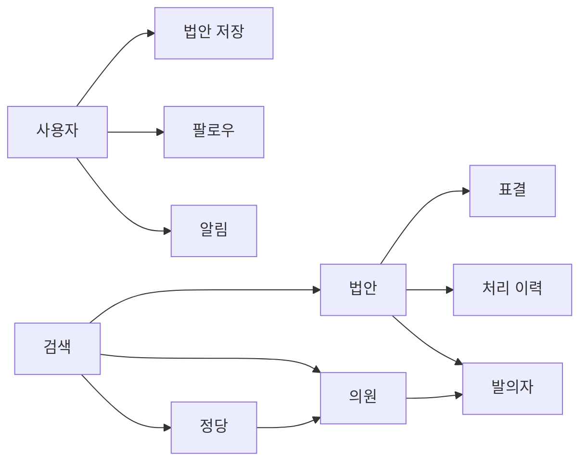

## Abstract

공개 API와 도메인 모델은 웹 화면이 쓰는 서비스 경계다. 법안, 의원, 정당, 검색, 사용자, 알림, 통계, 선거 정보를 요청 단위로 묶어 제공한다.

## Introduction

웹 화면은 많은 데이터를 작은 화면 흐름에 맞게 필요로 한다. API 계층은 원천 테이블을 그대로 노출하지 않고, 화면이 읽기 좋은 응답으로 조합한다. 인증된 사용자의 저장·팔로우 상태도 이 계층에서 함께 섞인다.

## Related Work

- [Lawdigest](../README.md)
- [법안 읽기 경험](../bill-reading/README.md)
- [인증과 접근 제어](./authentication/README.md)
- [입법 데이터 파이프라인](../data-pipeline/README.md)
- [선거·여론 인사이트](../election-insight/README.md)

## Description

요청 경계는 기능별로 나뉘지만 내부에서는 공통 도메인 데이터를 공유한다. 법안 상세는 법안 정보뿐 아니라 표결, 정당별 표결, 저장 상태를 함께 조합한다. 의원과 정당 상세는 팔로우 상태와 관련 법안 목록을 함께 제공한다.



API 내부는 대체로 세 역할로 나뉜다. 요청 경계는 입력과 응답 형식을 다루고, 조합 계층은 여러 도메인 결과를 화면 단위로 묶으며, 서비스 계층은 실제 규칙과 조회를 담당한다.

```text
요청 처리 흐름
요청 경계
  -> 화면 단위 조합
  -> 도메인 규칙
  -> 저장소 조회
  -> 표준 응답
```

공통 응답과 오류 처리도 중요하다. 인증이 필요한 요청은 사용자 맥락을 확인하고, 잘못된 입력이나 누락된 데이터는 정해진 오류 형태로 반환한다.

## Conclusion

공개 API는 Lawdigest 화면과 데이터 사이의 계약이다. 화면이 법안을 쉽게 읽게 만드는 일은 결국 이 계층이 도메인 데이터를 얼마나 안정적으로 조합하느냐에 달려 있다.
