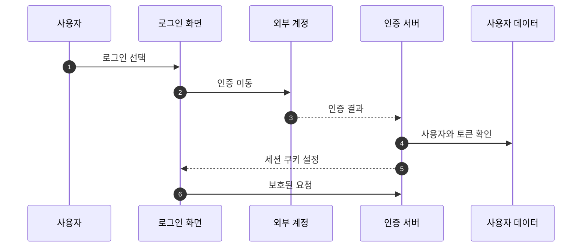
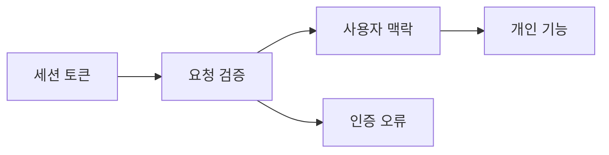

## Abstract

인증과 접근 제어는 외부 계정 로그인, 세션 토큰, 보호된 API 요청을 연결한다. 저장, 팔로우, 알림, 마이페이지 같은 개인 기능은 이 흐름에 기대어 동작한다.

## Introduction

Lawdigest는 읽기 기능 대부분을 공개로 제공하지만, 관심 표시와 개인 활동에는 사용자 식별이 필요하다. 인증 계층은 외부 계정 인증 결과를 내부 사용자로 연결하고, 이후 요청에서 같은 사용자인지 확인한다.

## Related Work

- [공개 API와 도메인 모델](../README.md)
- [개인화와 알림](../../bill-reading/personalization/README.md)

## Description

로그인은 외부 계정 선택에서 시작한다. 인증이 끝나면 서버는 사용자 정보를 확인하고, 이후 요청에서 사용할 세션 정보를 만든다. 웹은 보호된 화면에 들어갈 때 이 상태를 기준으로 접근을 판단한다.

```text
인증 책임
├─ 외부 계정 인증 결과 수신
├─ 내부 사용자 연결
├─ 접근 토큰 발급과 검증
├─ 로그아웃과 토큰 정리
└─ 보호된 요청의 사용자 맥락 제공
```

접근 제어는 사용자 기능의 안전장치다. 저장한 법안, 팔로우한 의원과 정당, 알림 목록은 모두 현재 사용자 기준으로 조회되고 변경된다.



오류 경계도 함께 동작한다. 인증 실패와 권한 부족은 일반 서버 오류와 구분되어 화면이 다시 로그인하거나 접근을 멈출 수 있게 한다.

## Conclusion

인증과 접근 제어는 개인화 기능의 토대다. 법안 읽기는 공개 경험으로 열어두되, 사용자별 상태 변경은 명확한 사용자 맥락 안에서 처리한다.
