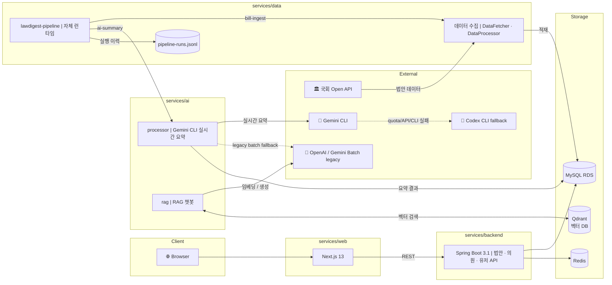

<div align="center">

# 모두의입법

**복잡한 국회 법안, AI가 쉽게 읽어드립니다**

[](https://nextjs.org/)
[](https://spring.io/projects/spring-boot)
[](https://www.python.org/)
[](https://ai.google.dev/gemini-api/docs/cli)
[](https://developers.openai.com/codex)
[](https://www.mysql.com/)

</div>

---

## 소개

**모두의 입법**은 국회에서 매일 쏟아지는 수백 건의 법률개정안을 AI가 핵심만 골라 요약해주는 서비스입니다.

어려운 법률 용어와 긴 원문 없이, 피드 형식의 친숙한 UI로 법안이 내 삶에 어떤 영향을 미치는지 한눈에 확인할 수 있습니다.

<br>

## 주요 기능

| 기능 | 설명 |
|------|------|
| **AI 법안 요약** | Gemini CLI 기반 실시간 요약 + Codex CLI fallback으로 법안 핵심 내용을 한 문장 + 항목별 상세 요약 제공 |
| **태그 분류** | 법안별 주제 태그 자동 생성으로 관심 분야 빠른 탐색 |
| **의원 / 정당 팔로우** | 관심 의원·정당의 법안 활동을 실시간으로 구독 |
| **법안 타임라인** | 발의 → 위원회 → 본회의까지 처리 단계 시각화 |
| **좋아요 & 알림** | 관심 법안 저장 및 상태 변경 알림 |
| **RAG 챗봇** | 법안 내용 기반 벡터 검색 + LLM 질의응답 |

<br>

## 기술 스택

### Frontend


### Backend


### AI / Data


### Infrastructure


<br>

## 아키텍처



<br>

## 서비스 구성

### `services/web` — 프론트엔드
피드 기반 법안 브라우저. 법안 상세, 의원·정당 프로필, 검색, 팔로우, 마이페이지 등을 제공합니다.

### `services/backend` — API 서버
법안·의원·정당·유저 도메인의 REST API를 제공합니다. OAuth2 소셜 로그인, JWT 인증, Redis 캐싱을 포함합니다.

### `services/data` — 데이터 파이프라인
국회 의안 Open API에서 법안 데이터를 수집·가공·적재하고, 자체 `lawdigest-pipeline` 런타임으로 상태 동기화와 AI 요약 실행을 오케스트레이션합니다.

### `services/ai` — AI 서비스
두 가지 책임을 가집니다.
- **`processor/`**: DB에 적재된 법안을 Gemini CLI 실시간 요약으로 처리하고, 장애 시 Codex CLI fallback 수행
- **`rag/`**: Qdrant 벡터 DB와 LLM을 결합한 법안 RAG 챗봇

<br>

## 데이터 파이프라인

현재 표준 실행 경로는 Airflow가 아니라 자체 `lawdigest-pipeline` 런타임입니다.

| 명령 | 역할 |
|------|------|
| `bill-ingest` | 국회 API → 정제 artifact → DB 법안 수집 |
| `bill-status-sync` | 의원·lifecycle·vote 상태 동기화 |
| `ai-summary` | Gemini CLI 기반 실시간 요약, Codex CLI fallback |
| `ai-batch-submit` / `ai-batch-ingest` | legacy Batch API fallback |

자세한 구조와 운영 명령은 [데이터 파이프라인 아키텍처](docs/data/법안%20데이터%20파이프라인/pipeline_architecture.md)와 [런타임 런북](docs/data/법안%20데이터%20파이프라인/pipeline_restart_runbook.md)을 기준으로 합니다.

<br>

## 로컬 실행

### 인프라 (Docker)

```bash
docker-compose up -d mysql redis
```

### 백엔드

```bash
cd services/backend
./gradlew bootRun
```

### 프론트엔드

```bash
cd services/web
npm install
npm run dev
```

### AI 서비스

```bash
cd services/ai
pip install -e .
```

> 환경변수 설정이 필요합니다. OpenAI API 키, DB 접속 정보, Qdrant 호스트 등을 `.env` 파일에 설정하세요.

<br>

## 라이선스

이 프로젝트는 MIT 라이선스 하에 배포됩니다.
