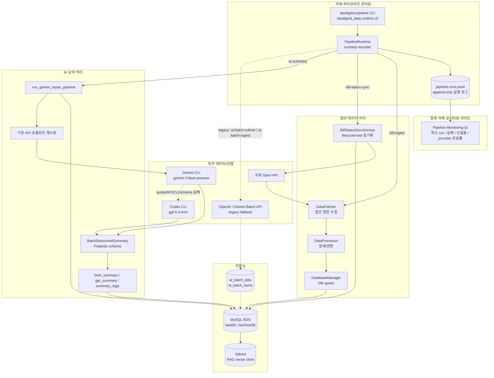
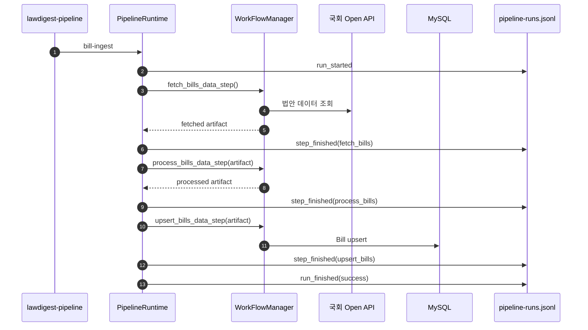
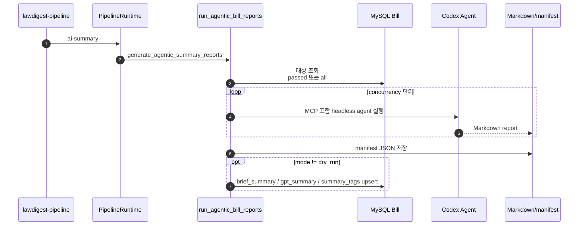

# Lawdigest 데이터 파이프라인 아키텍처

> 작성일: 2026-03-23
> 갱신일: 2026-05-19
> 현재 상태: **Airflow 폐기, 자체 `lawdigest-pipeline` 런타임 기준 운영**

---

## 1. 문서 기준

이 문서는 Lawdigest 법안 데이터 파이프라인의 현재 source of truth입니다.

- 표준 실행 경로: `services/data/src/lawdigest_data/runtime`
- 표준 CLI: `lawdigest-pipeline` 또는 `python -m lawdigest_data.runtime.cli`
- 표준 AI 요약: Codex MCP 에이전트 처리 (`gpt-5.4-mini`)
- AI 장애 대응: 명시적 Codex/Gemini/Claude CLI 복구 경로
- 실행 이력: append-only JSONL (`pipeline-runs.jsonl`)
- Airflow: 신규 운영 경로에서 제외, legacy reference로만 보관

관련 런북:

- [데이터 파이프라인 런타임 런북](./pipeline_restart_runbook.md)
- [상태 동기화 모니터링 쿼리](./status_sync_monitoring_queries.md)

---

## 2. 전체 구조



---

## 3. 실행 계층

### 3.1 CLI

경로:

- `services/data/src/lawdigest_data/runtime/cli.py`
- console script: `lawdigest-pipeline`

직접 실행:

```bash
PYTHONPATH=services/data/src:services/ai/src \
python -m lawdigest_data.runtime.cli <command> [options]
```

지원 명령:

| 명령 | 현재 역할 | 상태 |
|------|-----------|------|
| `bill-ingest` | 국회 API 법안 수집, 정제, DB 반영 | 표준 |
| `bill-status-sync` | 의원, lifecycle, vote 상태 동기화 | 표준 |
| `ai-summary` | Codex MCP 에이전트 기반 법안 요약/리포트 생성 | 표준 |
| `bill-agent-report` | Codex MCP 에이전트 기반 법안 종합 리포트 직접 실행 | 명시 실행 |
| `ai-repair-cli` | CLI 기반 결측 요약 복구 alias | 호환용 |
| `ai-repair-native` | OpenAI/Gemini API 기반 결측 요약 복구 | fallback |
| `ai-batch-submit` | OpenAI/Gemini Batch 제출 | legacy fallback |
| `ai-batch-ingest` | OpenAI/Gemini Batch 결과 회수 | legacy fallback |

### 3.2 Runtime

경로:

- `services/data/src/lawdigest_data/runtime/pipeline.py`

책임:

- run 시작/종료 이벤트 기록
- step별 성공 결과 기록
- 실패 시 error와 traceback 기록
- `pipeline-runs.jsonl` append-only 기록
- `WorkFlowManager`와 AI processor 호출

기본 로그:

```text
/tmp/lawdigest-pipeline/pipeline-runs.jsonl
```

운영 로그 위치 변경:

```bash
export LAWDIGEST_PIPELINE_LOG_DIR=/var/log/lawdigest-pipeline
```

---

## 4. 표준 파이프라인 흐름

### 4.1 법안 수집: `bill-ingest`



주요 모듈:

- `services/data/src/lawdigest_data/bills/DataFetcher.py`
- `services/data/src/lawdigest_data/bills/DataProcessor.py`
- `services/data/src/lawdigest_data/connectors/DatabaseManager.py`
- `services/data/src/lawdigest_data/core/WorkFlowManager.py`

### 4.2 상태 동기화: `bill-status-sync`

```text
update_lawmakers
  -> fetch_lifecycle_step
  -> upsert_lifecycle_step
  -> fetch_vote_step
  -> upsert_vote_step
```

주요 모듈:

- `services/data/src/lawdigest_data/core/bill_status_sync.py`
- `services/data/src/lawdigest_data/status/lifecycle_fetcher.py`
- `services/data/src/lawdigest_data/status/vote_fetcher.py`
- `services/data/src/lawdigest_data/status/projectors.py`

운영 기준:

- lifecycle은 `BillTimeline`과 `Bill` 최신 상태 projection을 함께 갱신
- vote는 표결 원천과 정당별 표결 projection을 함께 반영
- capability별 artifact와 checkpoint를 분리

### 4.3 AI 요약: `ai-summary`



현재 모델:

| Provider | 기본 모델 | 역할 |
|----------|-----------|------|
| Codex Agent | `gpt-5.4-mini` | 표준 법안 요약/리포트 |
| Codex CLI | `gpt-5.4-mini` | 명시적 CLI 복구용 |
| Gemini CLI | `gemini-3-flash-preview` | 수동 비교/복구용 보조 경로 |
| Claude CLI | 환경변수 지정 | 수동 비교/복구용 보조 경로 |

구조화 출력 계약:

```json
{
  "briefSummary": "...",
  "gptSummary": "...",
  "tags": ["...", "...", "...", "...", "..."]
}
```

DB 반영:

| structured key | DB column |
|----------------|-----------|
| `briefSummary` | `Bill.brief_summary` |
| `gptSummary` | `Bill.gpt_summary` |
| `tags` | `Bill.summary_tags` |

`briefSummary`는 기존 DB 스타일의 긴 제목형 요약으로 작성합니다. 즉, 핵심 변경 내용을 앞에 두고 마지막은 정확한 법안명으로 끝나는 형태를 표준으로 둡니다.

### 4.4 통과 법안 종합 리포트: `bill-agent-report`

`ai-summary`의 기본 엔진과 `bill-agent-report`는 처리 결과가 `원안가결`, `수정가결`, `가결`이거나 단계가 `공포`, `본회의 의결`인 통과 법안을 대상으로 합니다. `폐기`, `철회`, `부결`, `임기만료` 결과는 기본 대상에서 제외합니다.

이 경로는 일반 대량 요약이 아니라 품질 심화용입니다. Codex CLI를 headless agent로 실행하고 다음 MCP 서버를 주입해 법안별 Markdown 리포트를 생성합니다.

| MCP 서버 | 역할 |
|----------|------|
| `open-assembly` | 법안 상세, 심사경과, 발의자, 위원회, 표결 흐름 확인 |
| `assembly-api` | 국회 원천 API, 입법 라이프사이클, NABO/국민참여입법센터 보강 조회 |
| `korean-law` | 현행법 및 개정 법령 맥락, 관련 조문, 법령 인용 검증 |
| `korean-stats` | 정책 배경에 의미 있는 통계청 공식 통계와 출처 확인 |

출력은 기본적으로 `/tmp/lawdigest-bill-agent-reports` 아래 `bill_id.md`와 `manifest.json`으로 저장합니다. 생성된 리포트는 이후 `briefSummary`, `gptSummary`, `tags` 품질 개선이나 별도 상세 리포트 화면의 근거 자료로 활용합니다.

---

## 5. Legacy/Fallback 경로

### 5.1 Batch API 경로

명령:

- `ai-batch-submit`
- `ai-batch-ingest`

역할:

- 대량 백필이나 비교 검증을 위한 보조 경로
- OpenAI/Gemini Batch API 요청과 결과 회수
- `ai_batch_jobs`, `ai_batch_items`에 작업 메타데이터 저장

현재 신규 운영 표준은 아닙니다.

### 5.2 Native API 복구

명령:

- `ai-repair-native`

역할:

- OpenAI/Gemini API 기반 결측 요약 복구
- CLI 장애 시 수동 복구나 provider 비교용으로 사용

### 5.3 Airflow

Airflow 관련 파일은 legacy reference입니다.

- `infra/airflow/dags/*`
- `infra/airflow/docker-compose.yaml`
- `infra/airflow/DEPRECATED.md`

운영 판단은 Airflow UI가 아니라 `lawdigest-pipeline` 실행 결과와 `pipeline-runs.jsonl` 기준으로 합니다.

---

## 6. 데이터베이스와 주요 테이블

| 테이블 | 용도 |
|--------|------|
| `Bill` | 법안 기본 정보와 AI 요약 컬럼 |
| `Lawmaker` | 국회의원 정보 |
| `BillTimeline` | 법안 처리 단계 이력 |
| `VoteRecord` | 의원별 표결 |
| `VoteParty` | 정당별 표결 projection |
| `ai_batch_jobs` | legacy batch 작업 메타데이터 |
| `ai_batch_items` | legacy batch 항목별 결과 |

환경별 DB:

| 모드 | DB |
|------|----|
| `prod` | `lawDB` |
| `test`, `dry_run` 기본 쓰기 대상 | `lawTestDB` |

`ai-summary`는 `--read-mode prod`와 `--mode dry_run`을 함께 사용해 운영 DB를 읽고 결과 JSON만 생성할 수 있습니다.

---

## 7. 운영 원칙

1. 신규 기능은 `lawdigest_data.runtime`에 추가합니다.
2. Airflow DAG는 참고용으로만 읽고, 새 운영 경로로 되살리지 않습니다.
3. 표준 요약은 `ai-summary`의 기본 `agent` 엔진입니다.
4. 기존 CLI 경로는 `ai-summary --engine cli --cli-provider codex` 또는 `ai-repair-cli`로 명시 실행합니다.
5. 모든 실행은 `pipeline-runs.jsonl`과 산출물 JSON으로 검증합니다.
6. 모니터링 사이트는 우선 JSONL 로그를 읽고, 필요 시 DB 테이블로 확장합니다.

---

## 8. 문서 배치

| 문서 | 역할 |
|------|------|
| `docs/data/법안 데이터 파이프라인/pipeline_architecture.md` | 현재 구조 source of truth |
| `docs/data/법안 데이터 파이프라인/pipeline_restart_runbook.md` | 실행 명령과 운영 런북 |
| `docs/data/법안 데이터 파이프라인/status_sync_monitoring_queries.md` | 상태 동기화 확인 쿼리 |
| `docs/data/legacy/*` | Airflow/과거 리팩터링 기록 |
| `docs/data/pipeline_architecture.md` | canonical 문서 안내용 compatibility stub |
| `docs/data/pipeline_restart_runbook.md` | canonical 런북 안내용 compatibility stub |
