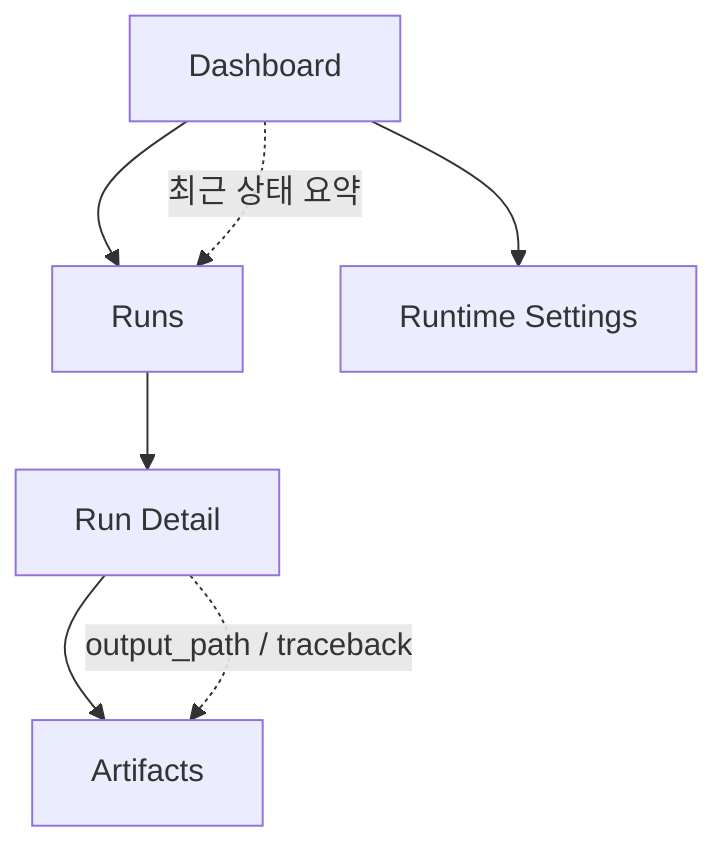
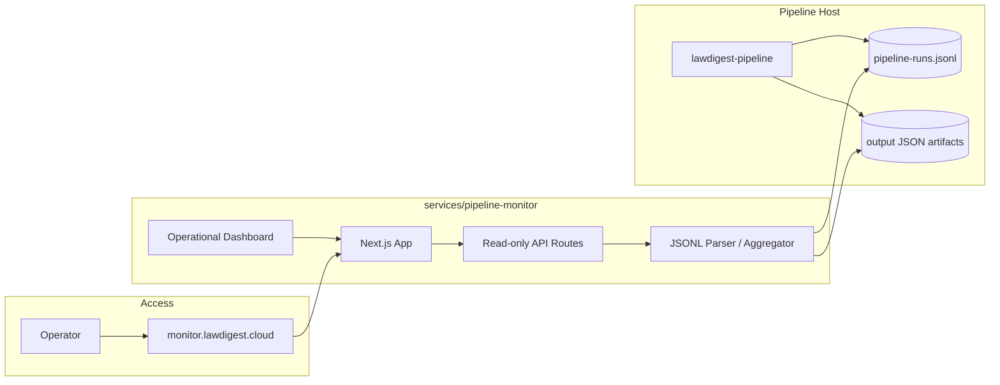

# 자체 데이터 파이프라인 모니터링 서비스 기획서

> 작성일: 2026-05-19
> 대상 서비스: `services/pipeline-monitor`
> 배포 방향: 별도 도메인을 갖는 독립 운영 모니터링 웹서비스
> 작업 순서: **기획서 작성 -> 디자인 시스템 구축 -> 실제 구현**

---

## 1. 배경

Lawdigest 데이터 파이프라인은 Airflow 중심 운영에서 자체 `lawdigest-pipeline` 런타임으로 전환되었습니다. 현재 실행 이력은 `pipeline-runs.jsonl`에 append-only 이벤트로 남고, 표준 AI 요약 경로는 Gemini CLI 실시간 처리와 Codex CLI fallback입니다.

운영자가 파이프라인 상태를 확인하려면 지금은 터미널에서 JSONL 로그와 산출물 JSON을 직접 열어봐야 합니다. 이 방식은 초기 검증에는 충분하지만, 반복 운영에서는 다음 정보가 빠르게 보이지 않습니다.

- 최근 어떤 파이프라인이 실행됐는지
- 어떤 명령이 실패했는지
- 실패 원인과 traceback이 무엇인지
- AI 요약 성공률과 fallback 상태가 어떤지
- 산출물 JSON이 어디에 저장됐는지
- 스케줄러나 수동 실행 이후 실제 처리량이 어땠는지

따라서 별도 도메인에서 접근하는 운영 전용 모니터링 서비스를 새로 구축합니다.

---

## 2. 목표

### 2.1 제품 목표

운영자가 터미널을 열지 않고도 Lawdigest 데이터 파이프라인의 최근 실행 상태, 실패 원인, 처리량, 산출물을 한 화면에서 파악할 수 있게 합니다.

### 2.2 기술 목표

- `services/pipeline-monitor`에 독립 웹서비스를 생성합니다.
- 첫 버전은 `pipeline-runs.jsonl`을 읽는 read-only 서비스로 시작합니다.
- 기존 Lawdigest 사용자 웹(`services/web`)과 배포/도메인/화면 구조를 분리합니다.
- 향후 DB 기반 `pipeline_runs`, `pipeline_run_steps`, `pipeline_artifacts` 테이블로 확장할 수 있는 데이터 모델을 유지합니다.

### 2.3 운영 목표

- `monitor.lawdigest.cloud` 또는 이에 준하는 별도 도메인으로 노출합니다.
- 운영자 전용 서비스로 취급하고, 공개 사용자-facing 기능과 분리합니다.
- 초기에는 수동/내부 접근을 우선하고, 배포 후 인증/접근 제어를 강화합니다.

---

## 3. 비목표

1차 버전에서 하지 않습니다.

- 파이프라인 실행 버튼 제공
- DB schema migration 기반 영구 run 테이블 생성
- Airflow UI 재구현
- Prometheus/Grafana 대체
- 사용자-facing Lawdigest 웹에 모니터링 화면 통합
- 복잡한 알림 라우팅 또는 온콜 관리

---

## 4. 사용자와 핵심 시나리오

### 4.1 사용자

| 사용자 | 필요 |
|--------|------|
| 운영자 | 최근 실행 상태, 실패 원인, 산출물 확인 |
| 개발자 | 새 파이프라인 기능 배포 후 smoke 결과 확인 |
| 데이터 관리자 | 수집/요약 처리량과 결측 상태 확인 |

### 4.2 핵심 시나리오

1. 운영자가 모니터링 도메인에 접속합니다.
2. 상단에서 최근 24시간 run 수, 성공/실패 수, 마지막 성공/실패 시간을 확인합니다.
3. 최근 run 목록에서 `ai.summary`, `bill.ingest`, `bill.status_sync`를 구분해 봅니다.
4. 실패 run을 열어 error, traceback, 실패 step, params를 확인합니다.
5. 성공 run을 열어 step별 처리량과 output path를 확인합니다.
6. AI 요약 run에서는 target/success/failure/upsert 카운트와 provider 정보를 확인합니다.

---

## 5. 1차 정보 구조



### 5.1 Dashboard

목적: 현재 상태를 10초 안에 파악합니다.

표시 정보:

- 최근 run 총수
- 성공/실패/진행 중 추정 수
- command별 실행 수
- 최근 실패 run
- 최근 AI 요약 성공률
- 마지막 실행 시각

### 5.2 Runs

목적: 실행 이력을 탐색합니다.

필터:

- command: `bill.ingest`, `bill.status_sync`, `ai.summary`, `ai.batch_submit`, `ai.batch_ingest`, `ai.native_repair`, `ai.cli_repair`
- status: `success`, `failed`, `running`, `unknown`
- 기간: 최근 1시간, 24시간, 7일
- mode: `dry_run`, `test`, `prod`

### 5.3 Run Detail

목적: 한 run의 원인과 결과를 확인합니다.

표시 정보:

- run metadata: `run_id`, `command`, `status`, `started_at`, `finished_at`, duration
- params
- step list
- step result summary
- error/traceback
- output path
- AI 요약 item summary

### 5.4 Artifacts

목적: output JSON과 파이프라인 artifact 위치를 확인합니다.

1차 버전에서는 파일 다운로드나 원문 전체 보기보다 경로와 요약 미리보기를 우선합니다.

---

## 6. 데이터 소스

### 6.1 현재 데이터 소스

```text
/tmp/lawdigest-pipeline/pipeline-runs.jsonl
```

환경변수:

```bash
LAWDIGEST_PIPELINE_LOG_DIR=/var/log/lawdigest-pipeline
```

### 6.2 이벤트 포맷

현재 런타임은 아래 이벤트를 기록합니다.

| event | 의미 |
|-------|------|
| `run_started` | run 생성, command와 params 기록 |
| `step_finished` | step 완료, step status와 result 기록 |
| `run_finished` | run 종료, 최종 status와 result 기록 |

### 6.3 파생 모델

모니터링 서비스는 JSONL 이벤트를 읽어서 아래 view model로 변환합니다.

```text
PipelineRun
  run_id
  command
  status
  params
  started_at
  finished_at
  duration_ms
  steps[]
  error
  traceback
  summary

PipelineStep
  step
  status
  timestamp
  result

PipelineSummary
  target_count
  processed_count
  success_count
  failure_count
  db_upserted_count
  output_path
  cli_provider
```

---

## 7. 시스템 구조



### 7.1 서비스 경계

`services/pipeline-monitor`는 독립 앱입니다.

책임:

- 모니터링 UI 제공
- JSONL 로그 read-only 파싱
- 최근 run aggregation
- run detail API 제공
- 향후 인증/배포 설정 보유

책임이 아닌 것:

- 파이프라인 실행
- DB upsert
- 기존 사용자 웹 라우팅
- Spring backend API 확장

---

## 8. 기술 선택

| 영역 | 선택 |
|------|------|
| 앱 | Next.js |
| 언어 | TypeScript |
| 데이터 접근 | Node.js filesystem read-only |
| 초기 저장소 | `pipeline-runs.jsonl` |
| 스타일링 | 다음 단계 디자인 시스템에서 확정 |
| 인증 | 1차는 배포 레벨 Basic Auth 또는 IP allowlist 우선, 앱 로그인은 2차 |
| 배포 | PM2 + nginx reverse proxy |
| 도메인 | `monitor.lawdigest.cloud` 후보 |

Next.js를 선택하는 이유:

- 독립 도메인 웹서비스 배포가 쉽습니다.
- 서버 Route Handler에서 JSONL 파일을 직접 읽기 쉽습니다.
- 화면과 read-only API를 같은 서비스 안에 둘 수 있습니다.
- 기존 `services/web` 경험을 참고하되 사용자-facing 앱과 분리할 수 있습니다.

---

## 9. 보안과 접근 제어

초기 운영 모니터링은 공개 서비스가 아닙니다.

1차 보호:

- nginx Basic Auth 또는 IP allowlist
- public 검색엔진 노출 방지
- API는 read-only
- 파일 접근은 허용된 로그/산출물 디렉터리 아래로 제한

2차 보호:

- 앱 내부 로그인
- 역할 기반 접근 제어
- 민감한 params redaction
- output JSON 원문 노출 정책

민감정보 처리:

- traceback과 params에는 환경 경로나 일부 내부 값이 포함될 수 있습니다.
- API key, password, token 형태 key는 응답 전 redaction합니다.

---

## 10. MVP 범위

### 10.1 반드시 포함

- `services/pipeline-monitor` 앱 스캐폴드
- read-only JSONL parser
- 최근 run 목록 API
- run detail API
- dashboard 화면
- run detail 화면
- 실패 traceback 표시
- AI summary stats 표시
- output path 표시
- 빈 로그/깨진 JSON line 대응
- README와 운영 실행 문서

### 10.2 포함하면 좋은 것

- command/status 필터
- 최근 24시간 success rate
- provider별 AI 요약 성공률
- output JSON 미리보기
- auto refresh

### 10.3 후속 버전

- DB 기반 run storage
- scheduler status
- 알림 연동
- run 재실행 버튼
- artifact 다운로드
- 사용자 인증

---

## 11. 화면 구성 초안

### 11.1 Dashboard

상단:

- 서비스명: Pipeline Monitor
- 현재 로그 경로
- 마지막 갱신 시각
- refresh control

요약 영역:

- Total runs
- Success runs
- Failed runs
- Latest run status
- AI summary success rate

본문:

- 최근 실패 run
- command별 실행 현황
- 최근 run table

### 11.2 Run Detail

상단:

- command
- status
- started/finished/duration
- mode, provider, target mode

본문:

- params JSON
- step timeline
- stats summary
- output path
- error/traceback block

---

## 12. 단계별 작업 계획

### Phase 1. 기획서

산출물:

- `pipeline_monitoring_service_plan.md`

검증:

- 서비스 경계가 `services/pipeline-monitor`로 명확한지
- MVP와 비목표가 구분되는지
- 데이터 소스가 현재 런타임과 맞는지

### Phase 2. 디자인 시스템

산출물:

- `docs/data/법안 데이터 파이프라인/pipeline_monitoring_design_system.md`

내용:

- 운영 도구용 정보 구조
- 색상/타이포그래피/간격 토큰
- 상태 색상: success, failed, running, unknown
- 테이블/타임라인/코드블록/필터 컴포넌트 규칙
- 반응형 기준
- 접근성 기준

### Phase 3. 구현

산출물:

- `services/pipeline-monitor`

예상 파일:

```text
services/pipeline-monitor/
  app/
    page.tsx
    runs/[runId]/page.tsx
    api/runs/route.ts
    api/runs/[runId]/route.ts
  lib/
    pipelineLog.ts
    redaction.ts
    time.ts
  components/
    DashboardSummary.tsx
    RunTable.tsx
    RunStatusBadge.tsx
    StepTimeline.tsx
    JsonBlock.tsx
  package.json
  next.config.js
  README.md
```

검증:

- 샘플 JSONL fixture 기반 unit test
- 실제 `/tmp/lawdigest-pipeline/pipeline-runs.jsonl` smoke
- `npm run lint`
- `npm run build`
- 로컬 dev server 화면 확인

### Phase 4. 배포 준비

산출물:

- PM2 app definition 또는 실행 스크립트
- nginx reverse proxy 초안
- Basic Auth 또는 IP allowlist 설정 문서
- `monitor.lawdigest.cloud` 도메인 연결 절차

---

## 13. 수용 기준

MVP 완료 조건:

1. 별도 앱 `services/pipeline-monitor`가 존재합니다.
2. `/`에서 dashboard를 볼 수 있습니다.
3. 최근 run 목록이 JSONL 기반으로 표시됩니다.
4. run detail에서 params, steps, stats, error/traceback을 볼 수 있습니다.
5. 로그 파일이 없어도 빈 상태가 깨지지 않습니다.
6. malformed JSON line이 있어도 나머지 run을 볼 수 있습니다.
7. API key/token/password류 값은 redaction됩니다.
8. 운영 문서에 로컬 실행과 배포 준비 절차가 있습니다.

---

## 14. 리스크와 대응

| 리스크 | 영향 | 대응 |
|--------|------|------|
| JSONL 파일이 커짐 | 응답 지연 | tail 기반 최근 N라인 읽기부터 시작, 이후 DB storage로 확장 |
| 로그 포맷 변경 | UI 파싱 실패 | parser에 버전 없는 tolerant parsing 적용 |
| output JSON이 매우 큼 | 화면 정지 | 원문 전체 렌더링 대신 요약/경로 우선 |
| 민감정보 노출 | 보안 사고 | redaction과 nginx 접근 제어 우선 적용 |
| monitor 앱 장애 | 운영 가시성 저하 | read-only 앱으로 파이프라인 실행과 격리 |
| 같은 호스트 파일 접근 권한 문제 | 로그 미표시 | `LAWDIGEST_PIPELINE_LOG_DIR`와 PM2 실행 유저 정렬 |

---

## 15. 결정 사항

- 독립 서비스 디렉터리는 `services/pipeline-monitor`로 둡니다.
- 첫 버전은 JSONL 기반 read-only 모니터링으로 시작합니다.
- 기존 사용자 웹과 Spring backend는 건드리지 않습니다.
- 디자인 시스템 문서를 먼저 만든 뒤 구현합니다.
- 배포 도메인은 `monitor.lawdigest.cloud`을 1차 후보로 둡니다.
