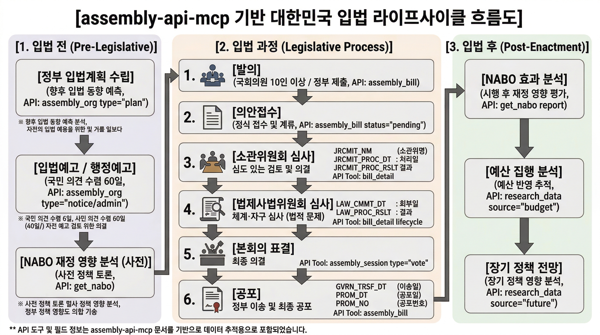

# Legislative Lifecycle — 입법 라이프사이클 완전 가이드

> assembly-api-mcp가 제공하는 입법 데이터로 입법 전/중/후 전 과정을 추적하는 방법을 설명합니다.

---

## 1. Legislative Lifecycle 개요

한국의 입법 절차는 크게 **6단계**로 구성됩니다:

```
정부/국회의원 발의
    ↓
의안접수 → 소관위원회 심사 → 법제사무위원회 심사 → 본회의 표결 → 정부이송 → 공포
```

| 단계 | 설명 | 핵심 질문 |
|------|------|---------|
| **발의** | 정부 또는 국회의원이 법안을 제출 | "누가 발의했나?" |
| **의안접수** |국회가 의안을 접수 | "의안이 정식으로 접수되었나?" |
| **소관위원회** | 해당 위원 상정·심사 | "위원회에서 어떻게 처리되었나?" |
| **법사위** | 법제사법위원회 재적용 심사 | "법적으로 문제가 없나?" |
| **본회의** | 본회의 상정·표결 | "본회의에서 표결되었나?" |
| **공포** | 정부가 법률을 공포 | "언제 공포되었나?" |

assembly-api-mcp는 이 **전 과정**을 데이터로 제공합니다:

| API 소스 | 커버하는 단계 |
|---------|-------------|
| **국회** (open.assembly.go.kr) | 발의 → 접수 → 소관위 → 법사위 → 본회의 → 공포 |
| **국민참여입법센터** (lawmaking.go.kr) | **입법 전** (계획/예고), 국민의견수렴 |
| **국회예산정책처** (nabo.go.kr) | **입법 전** (재정영향 분석), **입법 후** (효과 평가) |

---
### 1. 국회 발의 및 입법 예고 등 총괄적 통합 활용 방안

제공되는 AI 도구(프로필)들을 결합하면, 정책 연구자, 법률 전문가, 기업의 대관/법무 담당자 등이 입법 이슈를 총괄적으로 모니터링하고 대응하는 **'실시간 AI 입법 비서'**로 활용할 수 있습니다.

**① 실시간 입법 모니터링 및 자동화된 트래킹**

- **활용법:** AI에게 "최근 1개월간 '인공지능' 또는 '데이터' 키워드가 포함된 신규 발의 법안을 모두 찾아주고, 현재 진행 상태를 요약해 줘"라고 요청할 수 있습니다.
    
- **관련 도구:** `assembly_bill`(의안 검색 및 추적), `assembly_org`(입법예고 조회)
    
- **효과:** 기업이나 이익단체에 영향을 미칠 수 있는 규제나 법률안이 발의되거나 입법 예고되는 즉시 감지하여 선제적으로 대응할 수 있습니다.
    

**② 법안 심사 이력 및 회의록 심층 분석**

- **활용법:** 특정 법안(예: '중대재해처벌법 개정안')이 상임위원회나 법제사법위원회에서 어떻게 논의되고 있는지 분석합니다. "해당 법안에 대한 소위원회 회의록을 찾아 찬성/반대 의원의 주요 논거를 정리해 줘"라고 지시할 수 있습니다.
    
- **관련 도구:** `bill_detail`(의안 심층 조회: 제안자, 심사 이력 통합), `assembly_session`(일정, 회의록, 표결 내역)
    

**③ 국회의원/상임위 활동 스캐닝 및 정치적 지형 분석**

- **활용법:** 특정 이슈를 주도하는 국회의원들의 의정 활동을 입체적으로 분석합니다. "A 상임위 소속 의원들 중 B 산업 관련 법안을 가장 많이 발의한 의원 3명의 인적 사항과 최근 표결 성향을 분석해 줘"와 같은 입체적 조회가 가능합니다.
    
- **관련 도구:** `assembly_member`(의원 검색, 발의 이력, 표결 성향 통합 조회)
    

**④ 입법 배경 조사를 위한 공공 연구자료 및 여론 결합**

- **활용법:** 입법의 타당성을 분석하기 위해 "최근 저출산 관련 국민동의청원 내용과 국회예산정책처(NABO)의 관련 연구 보고서를 함께 찾아 종합해 줘"라고 요청할 수 있습니다.
    
- **관련 도구:** `petition_detail`(청원 상세 정보), `research_data`(국회도서관/입법조사처 자료), `get_nabo`(예산정책처 발간물)
    

---

### 2. 본 프로젝트가 가지는 핵심적인 의미와 가치

**① "자연어 인터페이스"를 통한 입법/공공 데이터의 민주화**

과거에는 국회 API의 방대한 데이터를 활용하려면 개발자가 270개가 넘는 API 명세서를 분석하고 코드를 작성해야 했습니다. 하지만 이 프로젝트를 통해 **누구나 평문(한국어)으로 복잡한 입법 쿼리를 실행**할 수 있게 되었습니다. 데이터 접근의 진입 장벽이 획기적으로 낮아진 것입니다.

**② 할루시네이션(환각) 없는 "신뢰성 높은 리걸테크 AI" 구현**

기존 LLM(거대 언어 모델)은 학습 데이터의 시점 한계로 인해 "현재 진행 중인 법안"이나 "최신 의석수"에 대해 거짓말(할루시네이션)을 하는 경우가 많았습니다. 이 MCP 서버는 AI가 **실시간으로 국가 공식 API를 찔러 원본 데이터를 가져온 뒤 답변을 생성**하게 하므로, 정보의 최신성과 정확성이 100% 보장됩니다.

**③ 입법 조사 및 법률 실무의 업무 생산성 극대화**

기자, 국회의원 보좌관, 로펌 변호사, 기업의 컴플라이언스 담당자가 기존에 국회 의안정보시스템을 일일이 검색하며 며칠씩 걸려 만들던 '입법 동향 보고서'나 '의원 프로필 조사'를 단 몇 분 만에 AI가 데이터 기반으로 작성할 수 있게 됩니다.

**④ AI 에이전트(Agentic AI) 시대의 훌륭한 시빅테크(Civic Tech) 선례**

최근 글로벌 AI 트렌드인 MCP(모델이 외부 세계와 소통하는 표준 규격)를 대한민국 공공데이터(Civic Data)에 선도적이고 전면적으로 적용한 사례입니다. AI가 단순히 텍스트를 생성하는 것을 넘어, **'공공 정책 비서'로서 도구를 들고 능동적으로 국회 데이터베이스를 탐색하는 에이전트**로 진화했음을 보여주는 의미 있는 시도입니다.


---

## 3. 데이터 커버리지 매트릭스



### 입법 단계별 활용 도구

| 단계 | MCP 도구 | REST API | 주요 필드 |
|------|---------|---------|---------|
| **입법 계획** | `assembly_org(type="lawmaking", category="plan")` | `GET /api/org?type=lawmaking` | lmPlnSeq, lsNm, mgtDt |
| **입법 예고** | `assembly_org(type="lawmaking", category="notice")` | `GET /api/org?type=lawmaking` | ogLmPpSeq, lsNm, stYd, edYd |
| **행정 예고** | `assembly_org(type="lawmaking", category="admin")` | `GET /api/org?type=lawmaking` | ogAdmPpSeq, admRulNm, pntcNo |
| **의안 접수** | `assembly_bill(status="pending")` | `GET /api/bills?status=pending` | BILL_NO, PROPOSE_DT |
| **위원회 심사** | `bill_detail(bill_id, fields=["review", "meetings"])` | `GET /api/bills/{bill_id}/review` | JRCMIT_NM, PROC_RSLT |
| **법사위 심사** | `bill_detail(bill_id, fields=["lifecycle"])` | `GET /api/bills/{bill_id}/history` | LAW_CMMT_DT, RGS_RSLN_DT |
| **본회의 표결** | `assembly_session(type="vote")` | `GET /api/votes` | PROC_DT, CURR_COMMITTEE |
| **국민 참여** | `assembly_org(type="petition")` | `GET /api/petitions` | PTTI_TITL, PTTI_CD |
| **법령 해석** | `assembly_org(type="lawmaking", category="interpretation")` | `GET /api/org?type=lawmaking` | itmNm, joCts |
| **의견제시** | `assembly_org(type="lawmaking", category="opinion")` | `GET /api/org?type=lawmaking` | caseNm, reqOrgNm |
| **NABO 보고서** | `get_nabo(type="report")` | `GET /api/nabo?type=report` | subj, cdNm, pubDt |
| **연구 자료** | `research_data` | `GET /api/research` | 제목, 저자, 발행일 |

---

## 3. Pre-Legislative (입법 전)

입법 전 단계는 법안이 국회에 정식 제출되기 **전**에 해당합니다. 이 단계에서 정부는 입법계획을 수립하고, 예고를 통해 국민의 의견을 수렴합니다.

### 3.1 입법계획 (Legislative Plan)

`assembly_org(type="lawmaking", category="plan")` 또는 CLI:

```bash
# 입법계획 목록 (전체)
npx tsx src/cli.ts lawmaking --type plan

# 특정 연도 입법계획
npx tsx src/cli.ts lawmaking --type plan --key 교육

# 특정 부처 입법계획 (행안부)
npx tsx src/cli.ts lawmaking --type plan --org 1741000
```

**API**: `GET /rest/lmPln`

**의미**: 정부의 연간 입법계획은 다음 해에 발의할 법안을 미리 발표한 것입니다. 이를 추적하면 **향후 입법 동향**을 예측할 수 있습니다.

### 3.2 입법예고 (Legislative Notice)

`assembly_org(type="lawmaking", category="notice")` 또는 CLI:

```bash
# 진행중인 입법예고
npx tsx src/cli.ts lawmaking --type notice

# 종료된 입법예고
npx tsx src/cli.ts lawmaking --type notice --diff 1

# 특정 법령 예고 검색
npx tsx src/cli.ts lawmaking --type notice --keyword 인공지능
```

**API**: `GET /rest/ogLmPp`

**의미**: 법안이 정식 발의되기 전에 공개되어 **60일** 동안 국민 의견을 수렴합니다. 이 단계에서 시민참여가 가능합니다.

### 3.3 행정예고 (Administrative Notice)

`assembly_org(type="lawmaking", category="admin")` 또는 CLI:

```bash
# 진행중인 행정예고
npx tsx src/cli.ts lawmaking --type admin

# 마감된 행정예고
npx tsx src/cli.ts lawmaking --type admin --closing Y

# 특정 자치법규 예고
npx tsx src/cli.ts lawmaking --type admin --keyword 주민자치
```

**API**: `GET /rest/ptcpAdmPp`

**의미**: 중앙행정기관이 아닌 **지방자치단체**의 조례/규칙이 제정/개정될 때 예고됩니다. 시민이 직접 참여할 수 있는 단계입니다.

### 3.4 NABO 재정 영향 분석

`get_nabo(type="report")` 또는 CLI:

```bash
# NABO 보고서 검색
npx tsx src/cli.ts nabo --type report --key 예산

# 특정 분야 보고서
npx tsx src/cli.ts nabo --type report --key 세제

# NABO 정기간행물
npx tsx src/cli.ts nabo --type periodical --key 경제동향
```

**의미**: NABO(국회예산정책처)는 법안에 대한 **재정 영향 분석**, 경제 전망, 세제 분석 보고서를 Publish합니다. 입법 전 정책 Discussion에 활용됩니다.

### 3.5 연구 자료

`research_data(keyword)` 또는 CLI (없음, MCP만):

```typescript
// 연구 자료 통합 검색
research_data({
  keyword: "인공지능 규제",
  source: "all_integrated"  // 도서관 + 입법조사처 + 예산정책처 + 미래연구원
})
```

**의미**: 입법조사처의 법안 분석, 도서관의 학문적 참고자료, 미래연구원의 장기 전망 등을 통합 검색합니다.

---

## 4. Legislative Process (입법 과정)

입법 과정은 의안이 정식으로 국회에 접수되어 심사받는 단계입니다.

### 4.1 의안 접수 (Bill Receipt)

`assembly_bill(status="pending")` 또는 CLI:

```bash
# 계류 중인 의안
npx tsx src/cli.ts pending

# 특정 분야 의안
npx tsx src/cli.ts bills --name 교육 --age 22

# 특정 제안자 의안
npx tsx src/cli.ts bills --proposer 홍길동
```

**API**: `BILLRCP`

**의미**:국회에 접수된 모든 법안이 추적 가능합니다.

### 4.2 소관위원회 심사 (Committee Review)

`bill_detail(bill_id, fields=["review", "meetings"])` 또는 CLI:

```bash
# 의안 상세 조회 (심사 경과 포함)
npx tsx src/cli.ts bill-detail <BILL_ID>
```

**API**: `BILLJUDGE` (심사정보), `BILL_COMMITTEE_CONF` (위원회 회의정보)

**심사 경과 필드**:
- `JRCMIT_NM` — 소관위원회명
- `JRCMIT_PRSNT_DT` — 소관위 상정일
- `JRCMIT_PROC_DT` — 소관위 처리일
- `JRCMIT_PROC_RSLT` — 소관위 처리결과

### 4.3 법사위 심사 (Legislation Committee Review)

`bill_detail(bill_id, fields=["lifecycle"])` — 전체 Lifecycle 포함:

```bash
# 전체 심사 경과 확인
npx tsx src/cli.ts bill-detail <BILL_ID>
```

**lifecycle 필드** (ALLBILL API):
```
소관위원회 → 법제사務위원회 → 본회의 → 정부이송 → 공포
```

| lifecycle 필드 | 의미 |
|--------------|------|
| `JRCMIT_NM` | 소관위원회 |
| `JRCMIT_PRSNT_DT` | 소관위 상정일 |
| `LAW_CMMT_DT` | 법사위 회부일 |
| `LAW_PROC_RSLT` | 법사위 처리결과 |
| `RGS_RSLN_DT` | 본회의 의결일 |
| `GVRN_TRSF_DT` | 정부이송일 |
| `PROM_DT` | 공포일 |
| `PROM_NO` | 공포번호 |

### 4.4 본회의 표결 (Plenary Voting)

`assembly_session(type="vote")` 또는 CLI:

```bash
# 본회의 표결 결과
npx tsx src/cli.ts votes

# 특정 법안 표결
npx tsx src/cli.ts votes --bill-no 2204567

# 최근 처리 의안
npx tsx src/cli.ts recent
```

**API**: `VOTE_BY_BILL` (의안별 표결), `PLENARY_AGENDA` (부의안건)

### 4.5 국민의 참여 (Public Participation)

```bash
# 청원 검색
npx tsx src/cli.ts pending  # 계류 중

# 법령 해석례 검색
npx tsx src/cli.ts lawmaking --type interpretation --key 자동차

# 의견제시 사례
npx tsx src/cli.ts lawmaking --type opinion
```

**의미**: 국민은 청원, 법령 해석에 대한 의견, 행정예고에 대한 의견제시 등을 통해 입법에 직접 참여할 수 있습니다.

---

## 5. Post-Enactment (입법 후)

법안이 공포된 후에도 assembly-api-mcp로 후속 분석이 가능합니다.

### 5.1 NABO 효과 분석

`get_nabo(type="report")`로 법안 시행 후 효과를 분석합니다:

```bash
# 특정 분야 재정 분석
npx tsx src/cli.ts nabo --type report --key 복지 --page 1

# NABO 정기간행물 (경제동향)
npx tsx src/cli.ts nabo --type periodical --key 경제동향
```

**의미**: NABO는 법안 시행 후 **예산 집행 분석**, **재정 영향 평가**를 Publish합니다.

### 5.2 예산 집행 분석

`research_data(source="budget")` 또는 MCP:

```typescript
research_data({
  keyword: "교육예산",
  source: "budget"
})
```

**의미**: 예산정책처의 예산 분석 자료로 법안에 따른 **예산 반영**을 추적합니다.

### 5.3 장기적 정책 전망

`research_data(source="future")`:

```typescript
research_data({
  keyword: "디지털 전환",
  source: "future"
})
```

**의미**: 국회미래연구원의 장기 정책 전망 연구로 입법의 **장기적 영향**을 분석합니다.

---

## 6. 활용 시나리오

### 시나리오: "AI 규제 법안" 전 생애 추적

```
[1단계] 입법 전
─────────────────────────────────────────────────
# 政府의 年度입법계획에 AI 규제 관련 법안이 있나?
npx tsx src/cli.ts lawmaking --type plan --key AI
→ 결과: "AI 국가전략법 제정계획" 있음

# 입법예고 단계인지 확인
npx tsx src/cli.ts lawmaking --type notice --keyword 인공지능
→ 결과: "인공지능(AI) 규제법안" 예고 중 (의견수렴 기간)

# NABO에서 AI 재정 영향 분석 자료 확인
npx tsx src/cli.ts nabo --type report --key 인공지능
→ 결과: "AI 기술발전이 노동시장에 미치는 영향" 보고서 (2024)

─────────────────────────────────────────────────

[2단계] 입법 과정
─────────────────────────────────────────────────
# 국회에 접수된 AI 규제 관련 의안 검색
npx tsx src/cli.ts bills --name AI --size 20

# 특정 의안의 심사 경과 추적
npx tsx src/cli.ts bill-detail <BILL_ID>
→ 결과:
  - 소관위: 과학기술정보위원회 (2024-03-15 상정)
  - 법사위: 2024-04-20，처리중
  - 본회의: 표결 대기

# 본회의 표결 결과
npx tsx src/cli.ts votes --bill-no 2201567
→ 결과: 2024-05-01 可決

─────────────────────────────────────────────────

[3단계] 입법 후
─────────────────────────────────────────────────
# 공포 후 NABO 효과 분석
npx tsx src/cli.ts nabo --type report --key AI규제법
→ 결과: "AI규제법안 시행에 따른 재정영향 분석" (2025)

# 예산 집행 분석
# research_data(source="budget", keyword="AI")
→ 결과: "디지털 전환 예산 투자 계획" (2025)

# 미래연구원 장기 전망
# research_data(source="future", keyword="AI")
→ 결과: "AI 기술 발전 전망과 정책적 대응" (2030)
```

---

## 7. MCP 도구 Quick Reference

### Legislative Lifecycle 관련 도구 (Lite + Full)

| 도구 | 프로필 | 용도 |
|------|--------|------|
| `assembly_bill` | Lite | 의안 검색/추적/통계 |
| `assembly_org` | Lite | 위원회/청원/입법예고 (lawmaking type 포함) |
| `assembly_session` | Lite | 일정/회의록/표결 |
| `bill_detail` | **Full** | 의안 심층 (심사/이력/회의/생애주기) |
| `research_data` | **Full** | 도서관/입법조사처/예산정책처/미래연구원 통합 |
| `get_nabo` | **Full** | NABO 보고서/정기간행물/채용 |

### Key 파라미터

| 도구 | 파라미터 | 설명 |
|------|---------|------|
| `assembly_org` | `type="lawmaking"` | 국민참여입법센터 API전환 |
| `assembly_org` | `category="plan\|notice\|admin\|interpretation\|opinion"` |입법단계 구분 |
| `assembly_bill` | `status="pending\|processed\|recent"` | 의안 상태 필터 |
| `assembly_bill` | `keywords` | 의안명 키워드 추적 |
| `assembly_session` | `type="vote"` | 표결 조회 |
| `bill_detail` | `fields=["lifecycle"]` | 전체 입법 생애주기 |
| `get_nabo` | `type="report\|periodical\|recruitments"` | NABO 자료 유형 |
| `research_data` | `source="all_integrated"` | 4개 기관 통합 검색 |

---

## 8. API 소스 요약

| 소스 | URL | 주요 데이터 |
|------|-----|-----------|
| **국회** (open.assembly.go.kr) | 열린국회정보 | 의안/국회의원/일정/회의록/표결/청원 |
| **국민참여입법센터** (lawmaking.go.kr) | opinion.lawmaking.go.kr | 입법계획/예고/행정예고/법령해석/의견제시 |
| **국회예산정책처** (nabo.go.kr) | nabo.go.kr | 재정분석/경제전망/예산보고서 |
| **국회도서관** (nanet.go.kr) | nanet.go.kr | 학술 자료/Government 문서 |
| **입법조사처** | open.assembly.go.kr |입법조사 보고서 |
| **예산정책처** | open.assembly.go.kr | 예산 분석 자료 |
| **미래연구원** | open.assembly.go.kr | 장기 정책 전망 |

---

## 9. 이 문서에 대하여

정부 입법계획부터 행정예고, 국회 발의 법안까지 하나의 파이프라인으로 통합하여 관찰할 수 있다는 것은, 정책이 태동하는 순간부터 실제 현장에 규제로 적용되기까지의 **'엔드투엔드(End-to-End) 입법 라이프사이클'을 완벽하게 장악**할 수 있음을 의미합니다.

기존에는 국회(의안정보시스템)와 행정부(국민참여입법센터, 관보 등)의 데이터가 파편화되어 있어 반쪽짜리 모니터링에 그치는 경우가 많았습니다. 이 두 축을 통합했을 때 얻을 수 있는 장점과 입법 생애주기 전반에 걸친 연계성은 다음과 같습니다.

### 1. 전체 입법 라이프사이클과 통합 모니터링의 연계성

입법은 단절된 이벤트가 아니라 유기적인 흐름입니다. 각 단계별로 통합 데이터가 제공하는 인사이트가 달라집니다.

- **1단계: 태동기 (정부 입법계획)**
    
    - 정부 부처가 연간 어떤 법안을 추진할지 미리 선언하는 단계입니다. 이를 파악하면 국회에 법안이 등장하기 최소 수개월~1년 전에 향후 규제 지형의 변화를 예측할 수 있습니다.
        
- **2단계: 형성기 (입법예고)**
    
    - 정부안의 구체적인 조문이 처음 공개되고 국민 의견을 수렴하는 시기입니다. 법안이 국회로 넘어가 정치적 쟁점화가 되기 전에, 이해관계자나 전문가가 논리적인 근거를 바탕으로 가장 효과적으로 조문 수정을 이끌어낼 수 있는 **'골든타임'**입니다.
        
- **3단계: 심사기 (국회 발의 및 논의)**
    
    - 정부안과 국회의원들이 발의한 유사 법안(의원안)들이 상임위에서 병합되어 심사됩니다. 정부안의 원안이 국회 논의 과정에서 어떻게 타협되고 변형되는지 추적할 수 있습니다.
        
- **4단계: 실행기 (행정예고 및 하위 법령)**
    
    - 법률이 통과된 후, 실제 기술적 세부 사항이나 가이드라인을 정하는 시행령, 시행규칙, 고시가 제·개정됩니다. 모법(국회)과 하위 행정규칙(정부) 간의 위임 구조를 추적하여 빈틈없는 컴플라이언스를 가능하게 합니다.
        

### 2. 통합 관찰 체계가 갖는 핵심적인 장점과 의미

**① 사후 대응에서 '선제적 정책 설계'로의 패러다임 전환**

국회에 법안이 발의된 후 대응하는 것은 이미 늦은 경우가 많습니다. 특히 국가 AI 전략 위원회 차원의 거시적인 정책을 고민하거나, 새로운 기술 산업의 방향을 설정할 때는 정부 입법계획 단계부터 개입해야 합니다. 기획 단계의 정부 문서와 최종 국회 통과 법안 간의 간극(Gap)을 AI로 분석하여, 정책의 의도가 실제 입법으로 올바르게 구현되었는지 검증할 수 있습니다.

**② 국제 표준과 국내 규제·행정 지침 간의 정합성 확보**

법률 자체는 선언적이지만, 실질적인 파급력은 행정예고를 통해 발표되는 '고시'나 '가이드라인'에서 나옵니다. 예를 들어, 인공지능 레드팀(Red Team) 운영 가이드라인이나 웨어러블 기기의 수면 모니터링 성능 평가 기준 같은 고도의 기술적 요건들은 대부분 행정부의 규정으로 떨어집니다.

국회 법안(상위법)과 부처 행정예고(하위 규정)를 동시에 관찰하면, ISO/IEC 같은 국제 표준 개발 동향을 국내 행정 지침에 적기에 반영하고 위헌/위법적인 규제 충돌을 막아내는 촘촘한 아키텍처를 짤 수 있습니다.

**③ 이해관계자 충돌 예측 및 입법 리스크 최소화**

특정 기술이나 산업(예: 의료 기기 산업)에 대한 정부의 육성 계획(정부안)과 규제를 강화하려는 시민사회 및 정치권의 요구(의원 발의안)가 충돌하는 양상을 입체적으로 조망할 수 있습니다. 행정부의 입법예고 시 접수된 반대 의견들이 향후 국회 상임위 회의록에서 어떻게 다시 쟁점화되는지 맥락을 이어볼 수 있어, 입법 리스크에 대한 고도화된 정성적 평가가 가능해집니다.

결론적으로 정부와 국회의 입법/행정 데이터를 통합한다는 것은, **단순한 검색의 편의를 넘어 국가의 정책 의지가 실물 경제와 기술 표준의 규범으로 구체화되는 전체 해부도를 실시간으로 들여다볼 수 있는 강력한 레이다망을 구축하는 것**과 같습니다.

**최종 업데이트**: 2026-04-12

**관련 문서**:
- [README.md](../README.md) — 프로젝트 전체 개요
- [docs/tool-mapping.md](tool-mapping.md) — MCP 도구 ↔ API 매핑
- [docs/api-catalog.md](api-catalog.md) —국회 API 276개 전체 목록
- [USECASE.md](../USECASE.md) — 활용 사례 100선
